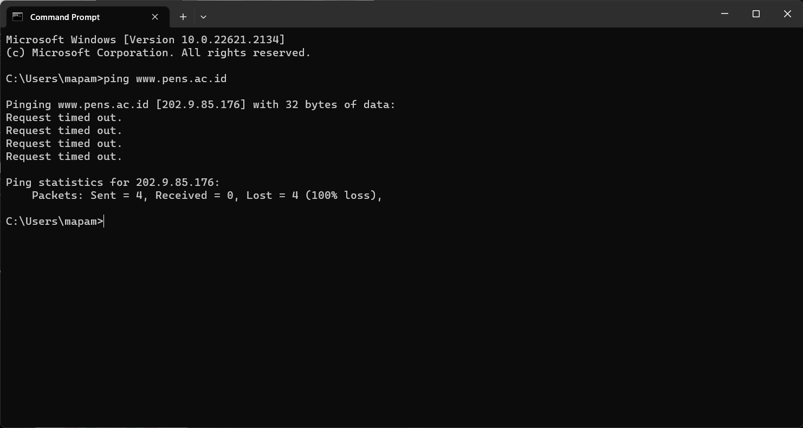
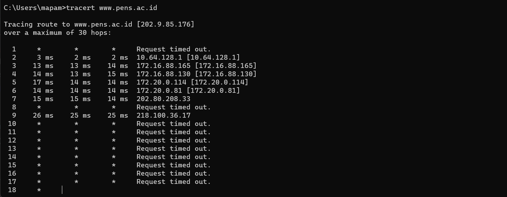

# Penjelasan PING dan Traceroute

# Ping

**Ping** adalah perintah dalam jaringan komputer yang digunakan untuk menguji koneksi dan responsibilitas antara perangkat. Dengan menggunakan protokol ICMP (Internet Control Message Protocol), perintah ping mengirimkan paket data ke tujuan yang ditentukan (seperti alamat IP atau nama domain) dan kemudian mengukur berapa lama waktu yang diperlukan untuk paket kembali. Ini membantu dalam menilai kecepatan dan kualitas koneksi serta untuk mendeteksi apakah perangkat tujuan dapat dijangkau. Hasil ping sering diukur dalam milisecond (ms), dan semakin rendah nilainya, semakin baik responsibilitas koneksi tersebut.

## Traceroute

**Traceroute** (atau tracert di lingkungan Windows) adalah perintah yang digunakan untuk melacak jalur yang dilewati oleh paket data dari satu perangkat ke perangkat lain di jaringan. Dengan menggunakan protokol ICMP atau UDP, perintah traceroute mengirimkan serangkaian paket data dengan TTL (Time To Live) yang bertambah secara berurutan. Setiap perangkat di jalur mengurangi TTL dan ketika TTL mencapai 0, perangkat tersebut mengirimkan pesan "Time Exceeded" kembali ke perangkat pengirim. Dengan menganalisis balasan dari setiap perangkat yang dilalui, traceroute membangun daftar hop atau node yang dilewati oleh paket data menuju tujuannya. Ini membantu untuk memahami rute dan latensi jaringan yang diambil oleh paket data.

