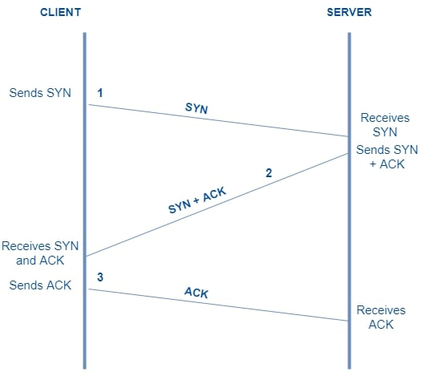

`Tugas ini merupakan tugas mata kuliah Konsep Jaringan yang dibimbing oleh Bpk. Dr. Ferry Astika Saputra,ST, M.Sc`

<h1>Penjelasan Three Way Shaking</h1>

 

Nama  : Mahargi Anugerahwan Pamungkas

Kelas : 2 D4 IT A

NRP   : 3122600012

 

  

Three-way handshake adalah proses yang digunakan dalam protokol TCP (Transmission Control Protocol) untuk membentuk koneksi antara dua perangkat, seperti klien dan server. Proses ini melibatkan tiga langkah yang diperlukan untuk memastikan bahwa kedua perangkat siap untuk berkomunikasi sebelum pertukaran data dimulai

<h3>Penjelasan Langkah-Langkahnya</h3>

<ol>
  <li>
    Step 1 : SYN (Synchronize) 
    

      <ul>
        <li>Perangkat pengirim (klien) mengirimkan paket SYN (synchronize) ke perangkat penerima (server).</li>
        <li>Paket SYN ini berisi nomor urut awal (ISN - Initial Sequence Number) yang digunakan untuk mengidentifikasi awal dari segmen data</li>
      </ul>
    

  </li>
   
  <li>
    Step 2 : SYN-ACK (Synchronize-Acknowledgement) 
    

      <ul>
        <li>Perangkat penerima (server) menerima paket SYN dari klien.</li>
        <li>Server kemudian merespons dengan mengirimkan paket SYN-ACK kepada klien.</li>
        <li>Paket SYN-ACK berisi nomor urut awal yang ditetapkan oleh server dan nomor urut awal dari klien (ISN).</li>
      </ul>
    

  </li>
   
  <li>
    Step 3 : ACK (Acknowledgement) 
    

      <ul>
        <li>Perangkat pengirim (klien) menerima paket SYN-ACK dari server.</li>
        <li>Klien merespons dengan mengirimkan paket ACK (acknowledgment) ke server.</li>
        <li>Paket ACK ini mengonfirmasi bahwa klien menerima SYN-ACK dari server.</li>
        <li>Nomor urut dalam paket ACK dinaikkan 1 dari nomor urut yang diterima dari server (acknowledgment).</li>
      </ul>
    

  </li>
</ol>

 

Dengan tiga langkah ini, koneksi TCP dianggap berhasil terbentuk. Setelah handshake selesai, perangkat klien dan server dapat mulai bertukar data dengan aman, karena mereka telah bersepakat untuk saling mengenali dan memahami nomor urut yang digunakan dalam pertukaran data.

