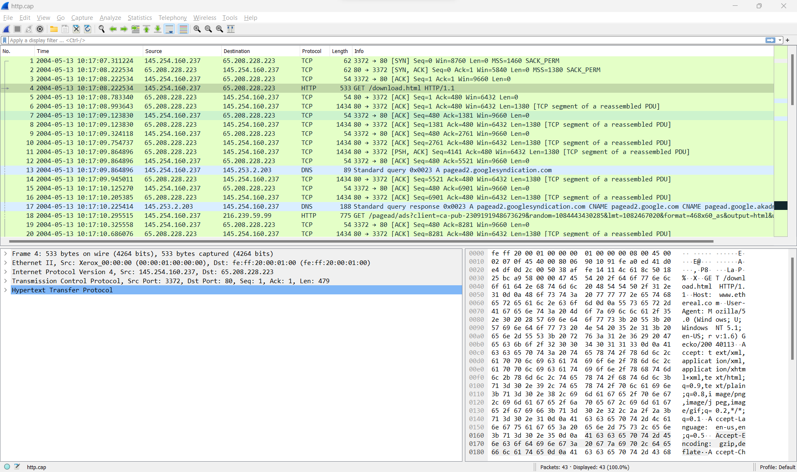
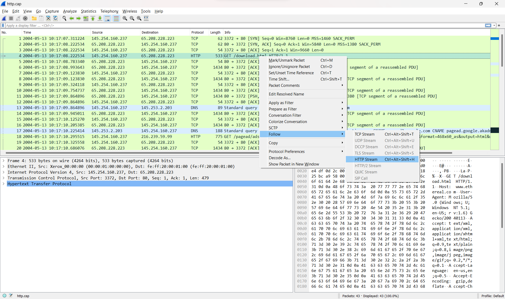
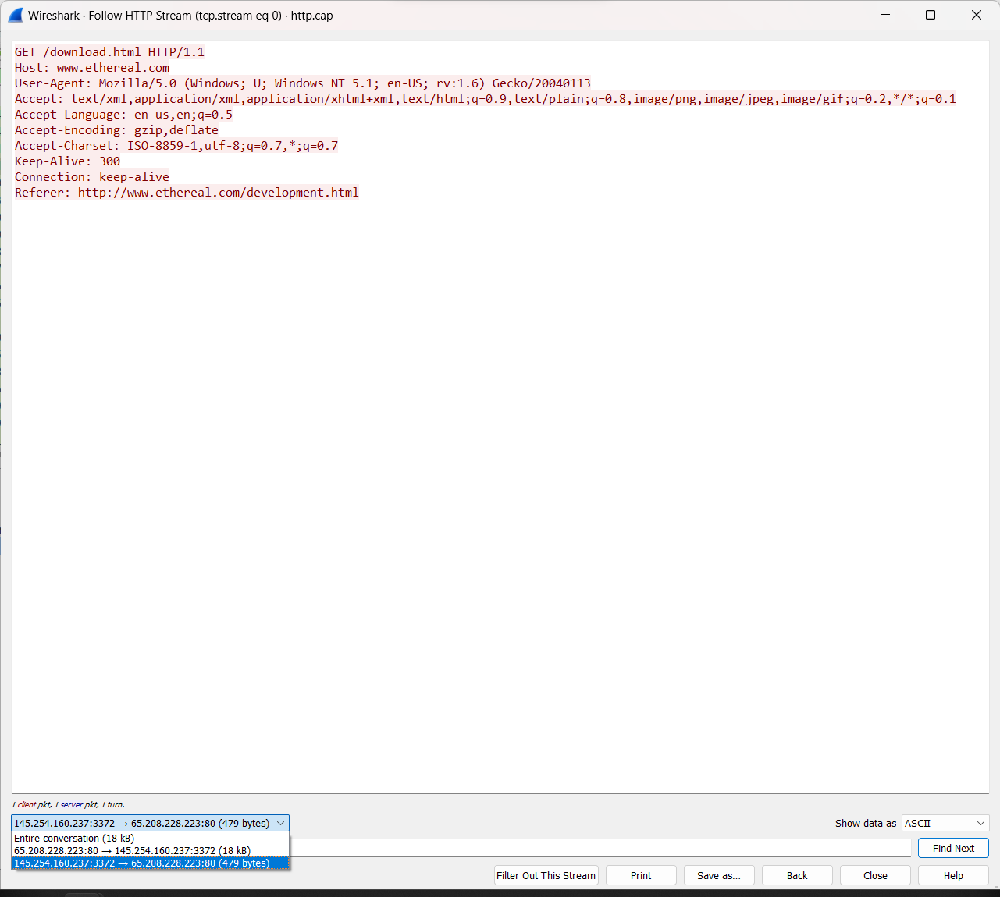
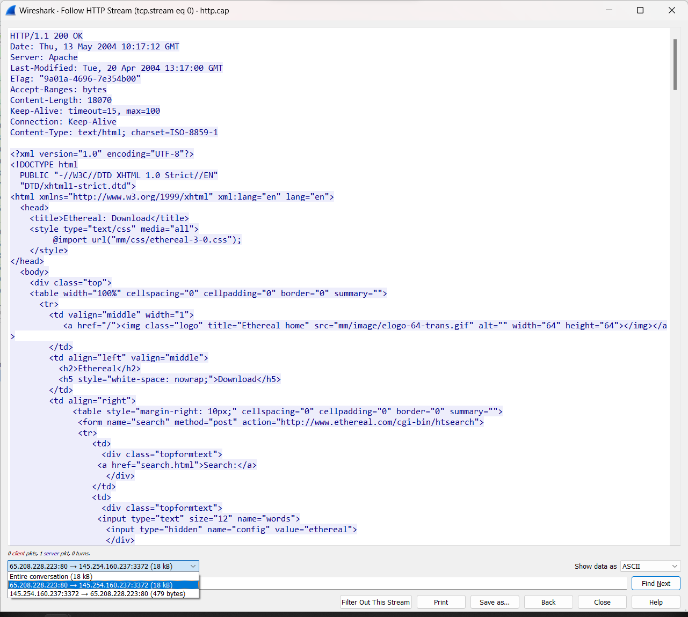
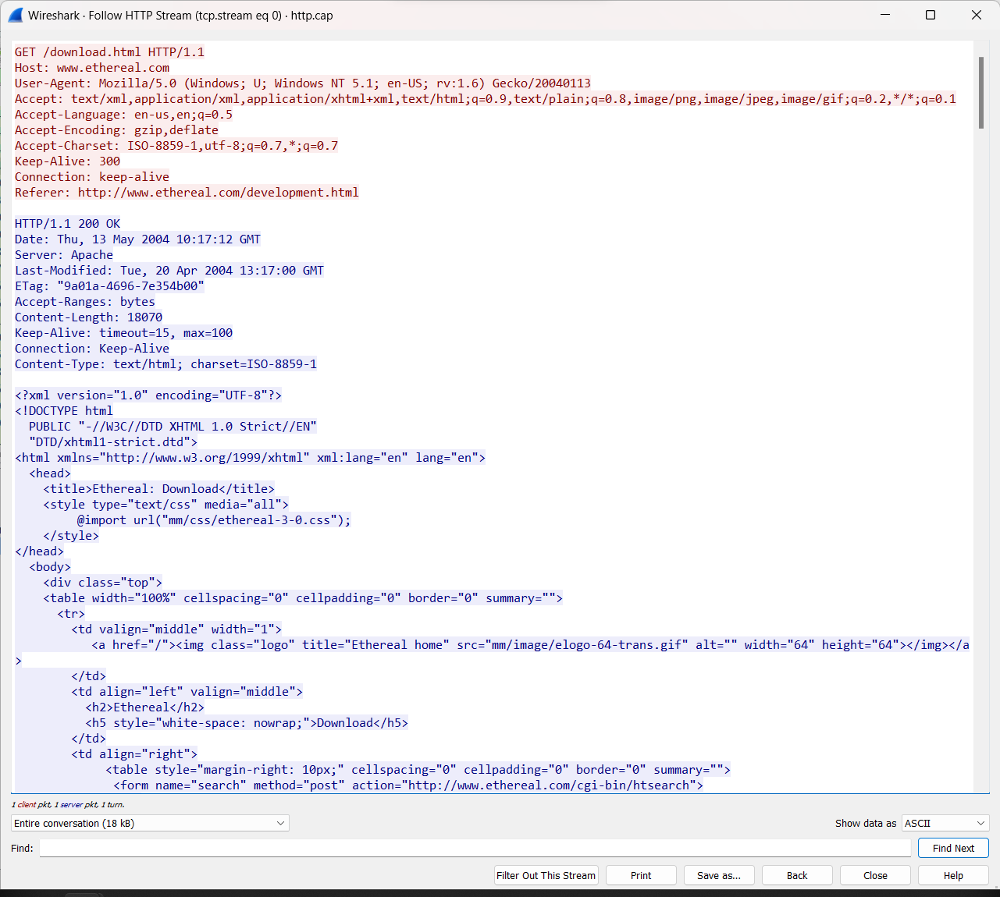
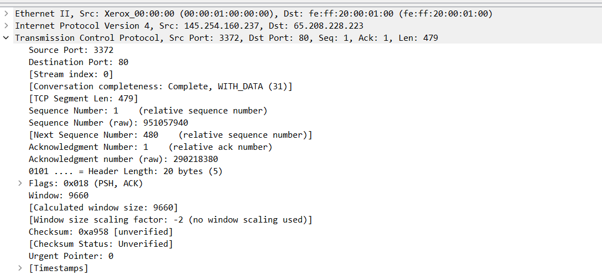
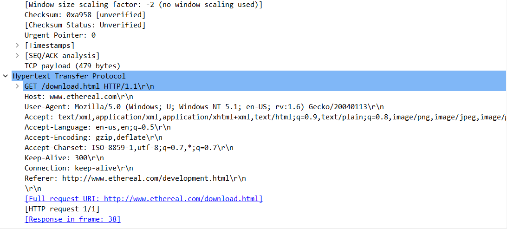
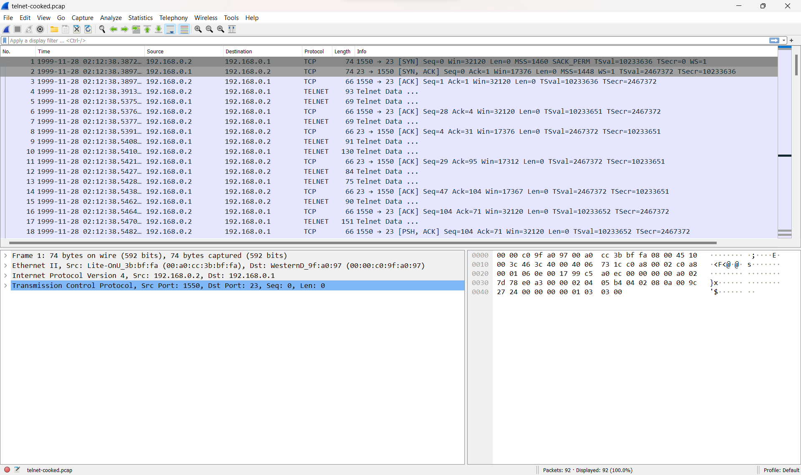
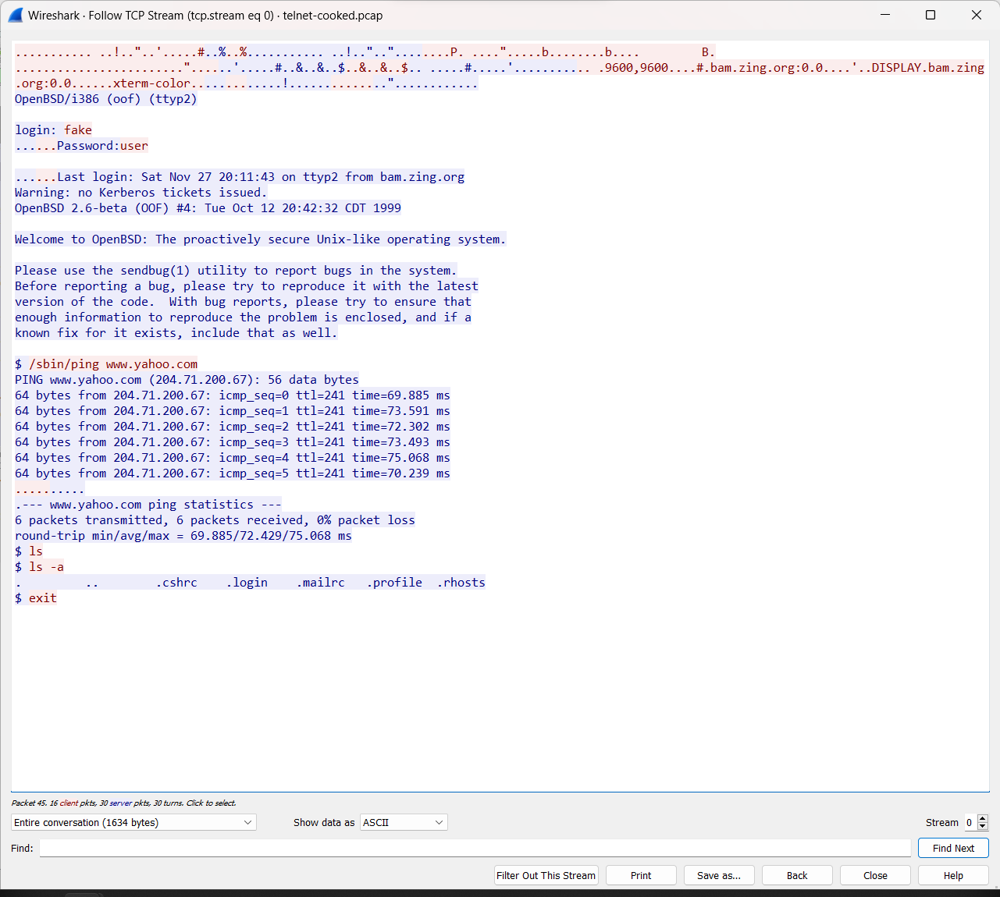

<h1>Praktikum Wireshark menggunakan Sample</h1>

 

Nama  : Mahargi Anugerahwan Pamungkas

Kelas : 2 D4 IT A

NRP   : 3122600012

 

Pada percobaan ini, kita menggunakan sample http.cap yang sudah kita download.

  

 

Untuk melihat seluruh aliran data dari sesi HTTP (HyperText Transfer Protocol) yang ditangkap dalam paket jaringan, kita dapat menggunakan fitur "Follow HTTP Stream". Ini membantu untuk melihat permintaan dan respons HTTP secara keseluruhan dalam konteks yang lebih mudah dibaca

  

 

Warna merah merupakan "request". ni mencakup permintaan yang dikirim oleh klien (seperti browser) ke server. Anda akan melihat detail seperti metode (GET, POST, dll.), URI, dan header permintaan.

  

 

Sedangkan warna biru merupakan "response". Ini mencakup balasan yang dikirim oleh server kepada klien sebagai tanggapan terhadap permintaan. Anda dapat melihat kode status HTTP, header respons, dan body data (jika ada).

  

 

Berikut jika keduanya digabungkan

  

 

Lalu kita juga dapat melihat berbagai informasi dari source yang kita inginkan. Semisalnya kita dapat melihat Source Port, dan Destination Portnya (Ditunjukkan bahwa Destination Portnya adalah 80 yang menandakan standar port untuk Web Server.)

  
  

 
 

Sekarang mari menggunakan sample baru yaitu TELNET:

  

 

Saat kita mengikuti Stream dari Telnet, kita dapat melihat bahwa request dan responsenya berbeda dari HTML, dari sini kita melihat bahwa request dan responsenya bertipe TCP yang berupa ThreeWay-Handshake.

  

 

Lalu mari kita mencoba sample DNS dan melihat Stream-nya

  

 
 

Dalam analisis jaringan kali ini, kita dapat melihat tiga jenis aliran data yang penting, yaitu HTTP Stream, TCP Stream, dan UDP Stream. HTTP Stream mengacu pada aliran data dalam protokol HTTP, membantu kita memahami bagaimana permintaan dan respons terjadi dalam komunikasi web. Sebaliknya, TCP Stream memberikan keandalan dan urutan pengiriman data, cocok untuk aplikasi yang memerlukan integritas data seperti transfer file. Di sisi lain, UDP Stream dalam protokol UDP menawarkan pengiriman data yang sederhana dan cepat, meskipun tidak menjamin pengiriman yang andal atau terurut. Pemilihan antara ketiganya tergantung pada kebutuhan aplikasi. HTTP Stream membantu analisis lalu lintas web, TCP Stream memberikan jaminan pengiriman andal, dan UDP Stream lebih cocok untuk aplikasi yang lebih toleran terhadap hilangnya beberapa data. Dalam keseluruhan konteks, ketiganya memiliki peran yang signifikan dalam memenuhi kebutuhan komunikasi jaringan yang beragam.

