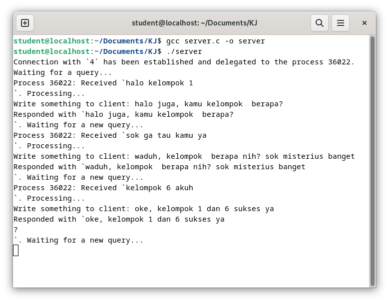
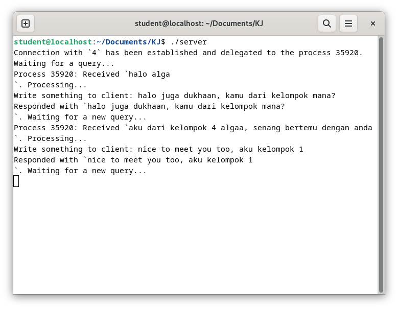
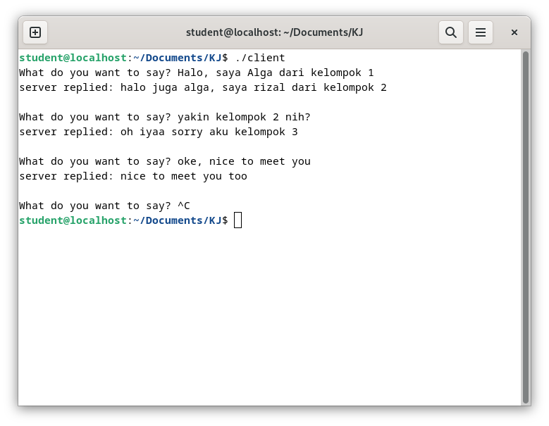

# Simple Server Client Response To Another Group
Simple Server-Client Using Socket Programming with C.

## Server



## Client





## Code

- client.c

```objectivec
portno = 10001;
...
// create socket and get file descriptor
sockfd = socket(AF_INET, SOCK_STREAM, 0);

server = gethostbyname("192.168.x.x");

if (server == NULL) {
    fprintf(stderr,"ERROR, no such host\n");
    exit(0);
}

```

Pastikan portno pada client.c sama persis seperti di server.c! dan juga pastikan server diubah menjadi IPv4 dari PC kelompok lain!

- server.c

```objectivec
int main( int argc, char *argv[] ) {
    const uint16_t port_number = 10001;
    ...
}
```
