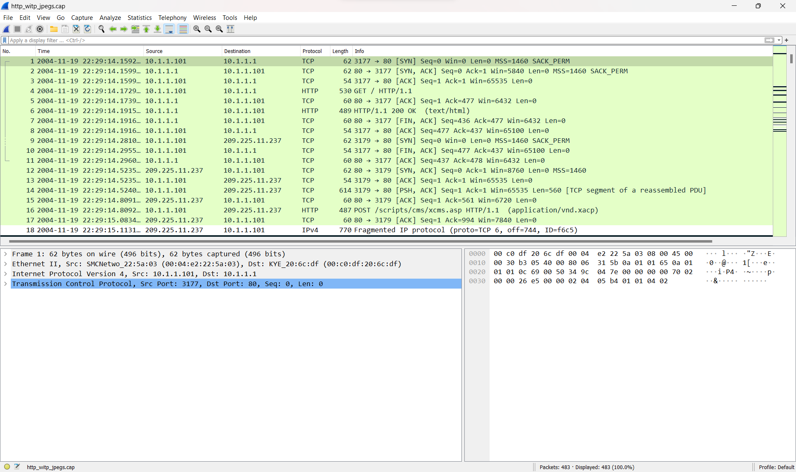
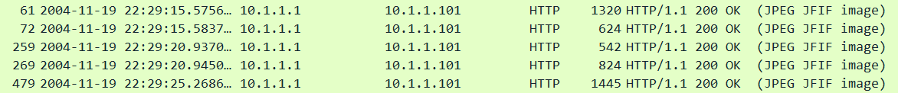
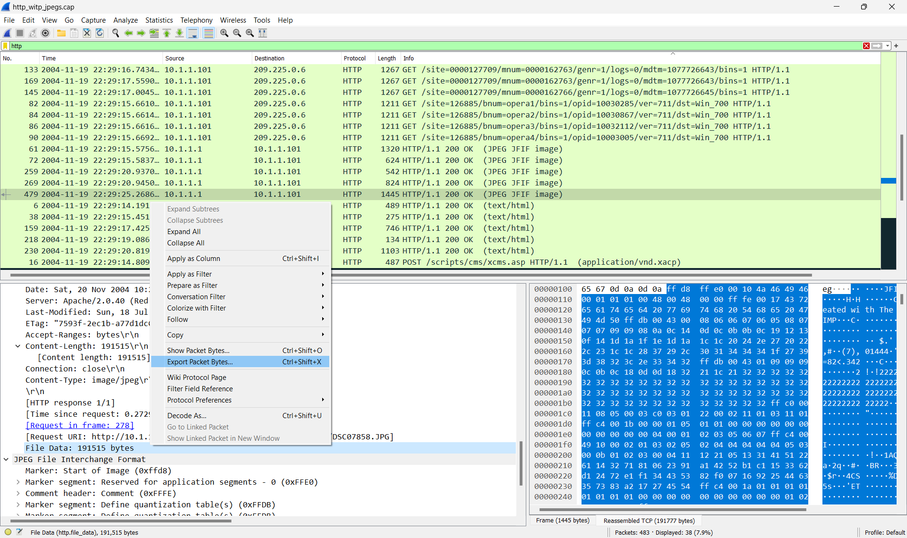
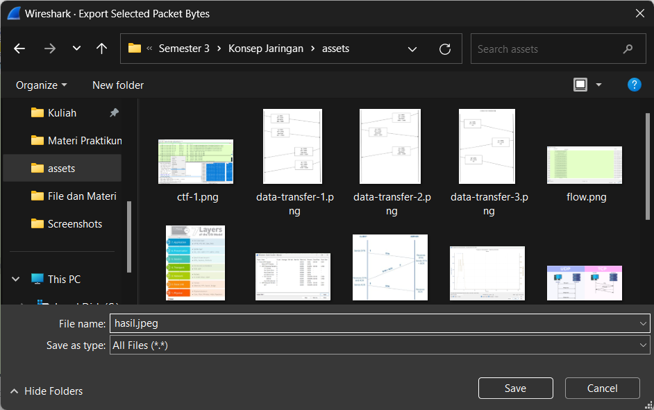

# Capture the Flag

MENCARI SEBUAH GAMBAR DARI HTTP.CAP

# Langkah-langkah

Membuka sample http.with.jpeg yang telah di download

Cari source dengan info yang mendapatkan gambar.

Klik source tersebut dan pada cari kolom "File Data" pada informasi source yang berada di kiri bawah. Kemudian klik kanan kolom "File Data" dan klik "Export Packet Bytes" 

Simpan file dengan ekstensi .jpeg

Berikut gambar yang kita dapat :

