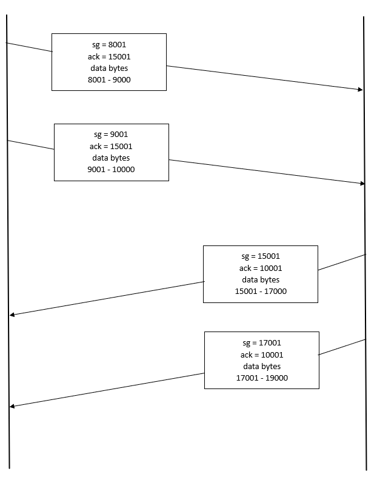
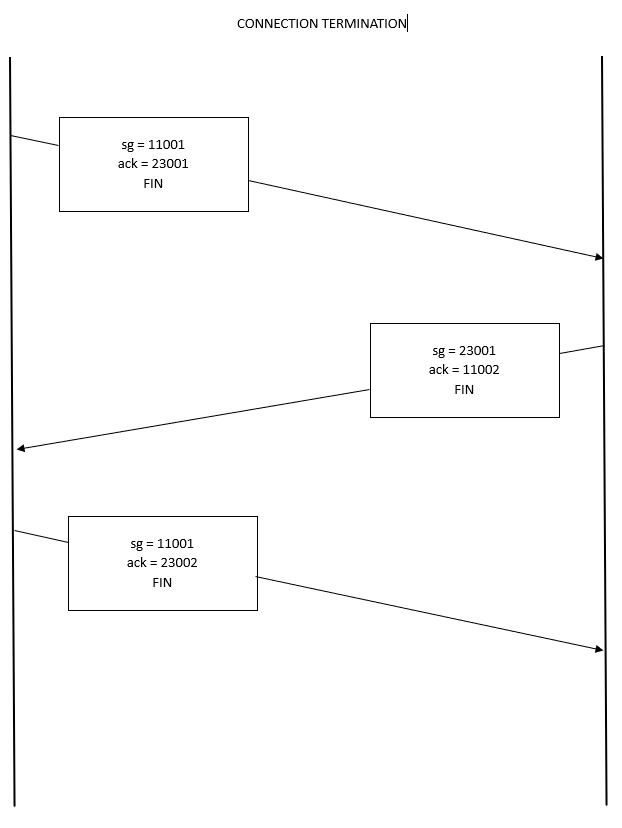

# Menganalisis Flow Graph dari Sample http.cap

Pada fitur Flow Graph, kita dapat melihat bagaimana proses dari Connection Establishment, Data Transfer, dan Connection Termination dari sebuah source.

Untuk melihat sebuah Flow Graph dari suatu source, kita dapat memilih "Statistics" dalam menubar dan memilih pilihan "Flow Graph"

Berikut adalah tampilan utama Flow Graph, 

Selanjutnya mari kita perkecil dengan filter TCP Flow.

Dari gambar di atas, kita dapat melihat proses ThreeWay-Handshake yang terjadi dan dalam detik berapa.

Kita melihat bahwa proses Connection Termination dimulai dari bagian Server pada detik ke-17s dan Client memutuskan koneksinya pada detik ke-30s. Server menginisialisasikan termination terlebih dahulu karena file/data transfer telah selesai terlebih dahulu pada bagian server sebelum Client.

