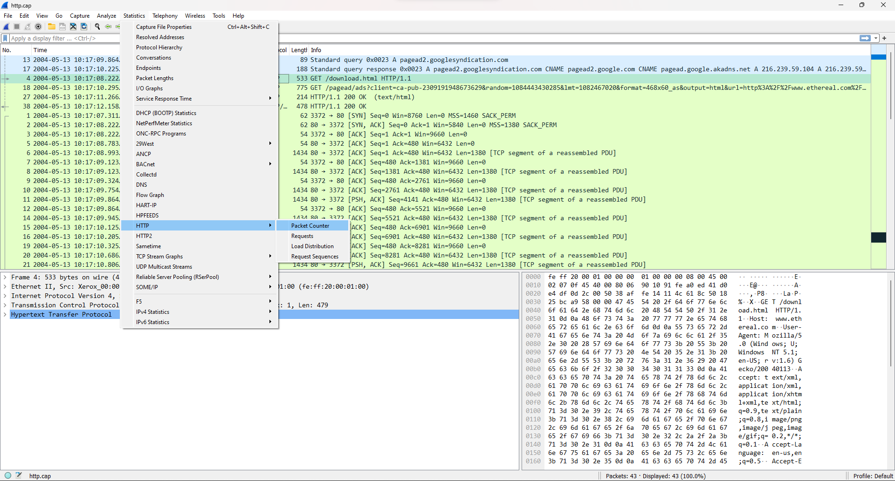

# Analisis Statistik

## Packet Counter
Packet counter adalah alat atau mekanisme yang digunakan untuk menghitung jumlah paket data yang melewati suatu titik dalam jaringan komunikasi. Dalam konteks jaringan, "paket" merujuk pada unit data kecil yang dikirim melalui jaringan dari satu perangkat ke perangkat lain. Setiap paket biasanya berisi sejumlah informasi, termasuk alamat sumber dan tujuan, data payload, dan informasi pengendali.

Penghitung paket digunakan untuk berbagai tujuan, termasuk pemantauan, analisis, manajemen jaringan, dan pengawasan lalu lintas. Beberapa konsep penting terkait dengan penghitung paket adalah:
1.  **Paket Masuk (Incoming Packets):** Penghitung paket dapat digunakan untuk menghitung jumlah paket yang masuk ke suatu perangkat atau jaringan dari sumber eksternal. Ini membantu dalam memahami beban lalu lintas yang masuk dan keluar dari jaringan.
    
2.  **Paket Keluar (Outgoing Packets):** Jumlah paket yang keluar dari suatu perangkat atau jaringan juga dapat dihitung. Ini membantu dalam mengukur aktivitas komunikasi dan transfer data dari perangkat tersebut.
    
3.  **Analisis Lalu Lintas:** Dengan menghitung jumlah paket dalam interval waktu tertentu, Anda dapat menganalisis pola lalu lintas jaringan, menentukan waktu sibuk dan tenang, serta mengidentifikasi tren dan potensi masalah.
    
4.  **Pengukuran Kualitas Jaringan:** Menghitung jumlah paket yang hilang atau korup di jaringan dapat membantu dalam mengukur kualitas jaringan. Jika terlalu banyak paket hilang, ini dapat menunjukkan masalah dalam pengiriman data.
    
5.  **Pengawasan Keamanan:** Penghitung paket dapat digunakan dalam pemantauan keamanan untuk mendeteksi potensi serangan atau aktivitas mencurigakan dengan melihat anomali dalam jumlah paket yang dihitung.
    
6.  **Pengendalian Jaringan:** Dalam beberapa kasus, penghitung paket dapat digunakan untuk mengatur aturan lalu lintas jaringan. Misalnya, jika jumlah paket melebihi ambang tertentu, tindakan dapat diambil untuk mengurangi beban atau mengambil langkah pengamanan.
    
7.  **Statistik Jaringan:** Informasi penghitung paket juga dapat digunakan untuk menghasilkan statistik terkait dengan lalu lintas jaringan, seperti rata-rata paket per detik, puncak lalu lintas, dan pola penggunaan.

Kita dapat melihat packet counter pada menubar Statistics, lalu pilih HTTP dan pilih Packet Counter.

Berikut packet counter dari source yang kita pilih :
 
Pada gambar di atas, kita melihat tentang Total HTTP Packets yang berisi HTTP Request Packets dan HTTP Response Packets. 

Seperti yang kita tahu, HTTP (Hypertext Transfer Protocol) adalah protokol yang digunakan untuk mengirim permintaan dan menerima respons antara klien (seperti browser web) dan server web. Permintaan dari klien kepada server dalam bentuk HTTP request packet (paket permintaan HTTP). Ini adalah bagian penting dari komunikasi antara klien dan server web.

HTTP request packet berisi informasi tentang apa yang diminta oleh klien dari server. Informasi ini termasuk:

1.  **HTTP Method (Metode HTTP):** Metode ini menentukan jenis tindakan yang ingin dilakukan oleh klien pada sumber daya yang diminta. Beberapa metode umum adalah:
    
    -   GET: Mengambil data dari server.
    -   POST: Mengirim data kepada server untuk memproses.
    -   PUT: Mengirim data kepada server untuk menggantikan atau membuat sumber daya.
    -   DELETE: Menghapus sumber daya di server.
2.  **URL (Uniform Resource Locator):** URL adalah alamat yang menunjukkan di mana sumber daya yang diminta berada di server.
    
3.  **HTTP Version (Versi HTTP):** Versi protokol HTTP yang digunakan dalam permintaan ini, seperti HTTP/1.1.
    
4.  **Headers (Header):** Header berisi informasi tambahan tentang permintaan, seperti tipe konten yang diterima oleh klien, tipe kompresi yang didukung, dan sebagainya.
    
5.  **Body (Tubuh):** Ini adalah bagian opsional dari permintaan yang berisi data yang dikirim oleh klien ke server. Ini terutama digunakan dalam metode POST untuk mengirim data formulir atau data lainnya.