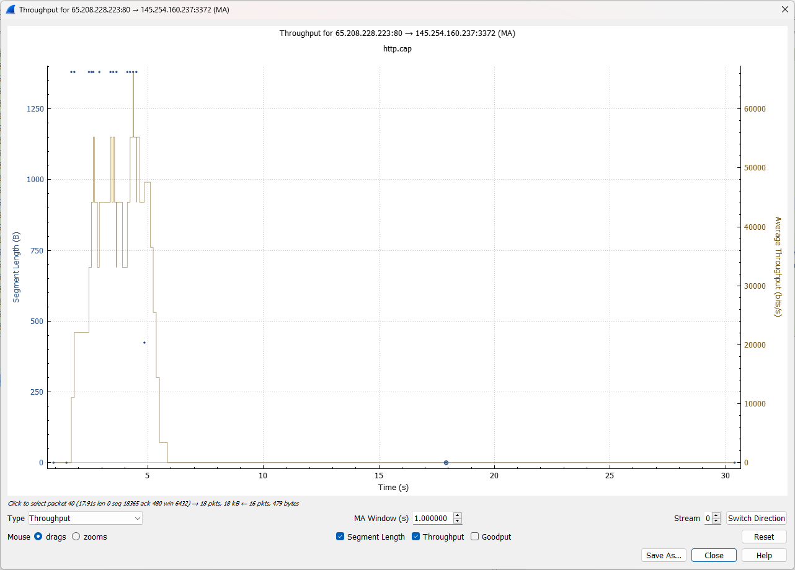
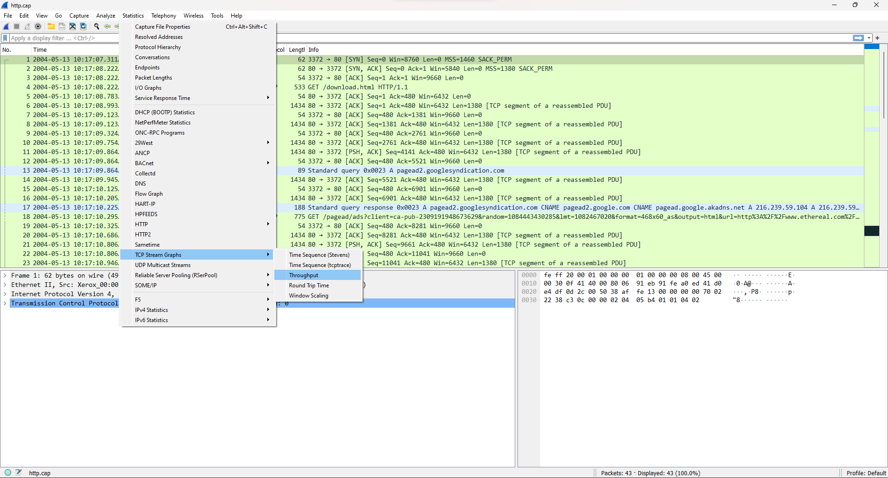

# Penjelasan Throughput

Throughput adalah ukuran seberapa efisien data dapat dikirim atau diterima melalui jaringan atau saluran komunikasi dalam suatu periode waktu tertentu. Ini mengukur seberapa banyak data yang dapat ditransfer dalam jumlah tertentu dalam waktu yang diberikan. Throughput diukur dalam unit data per waktu, seperti kilobit per detik (Kbps), megabit per detik (Mbps), atau gigabit per detik (Gbps), tergantung pada kecepatan transfer data yang diamati.

#
Kita dapat mengecek Throughput dengan cara, pada menubar Statistics, kita memilih TCP Stream Graphs dan memilih Throughput.

