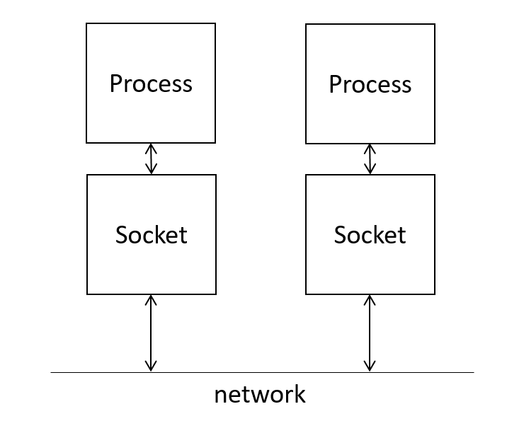
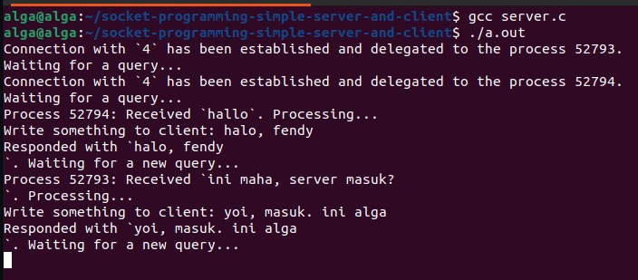
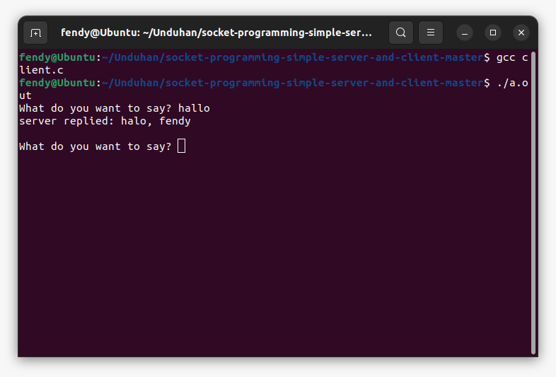
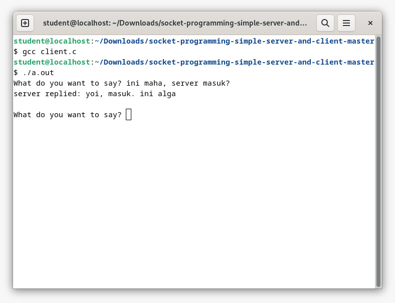
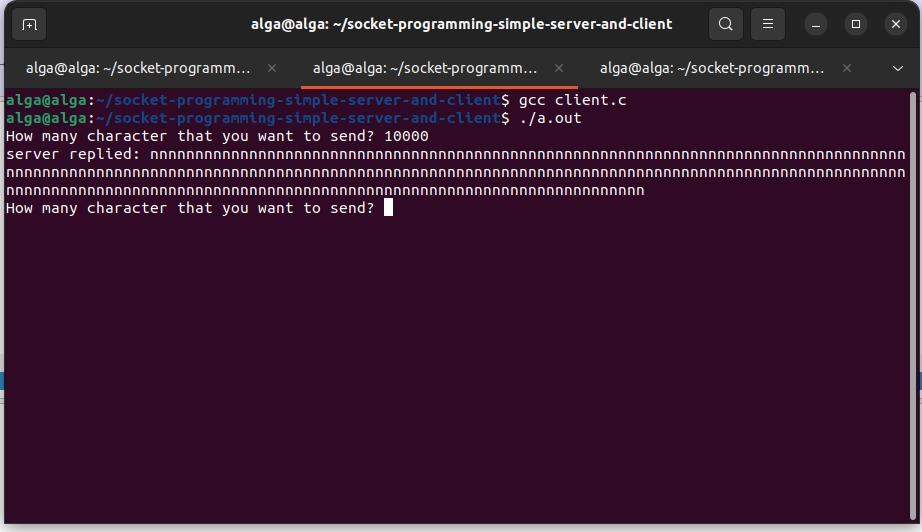
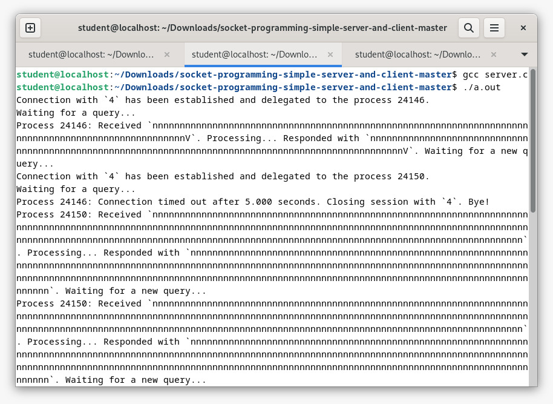
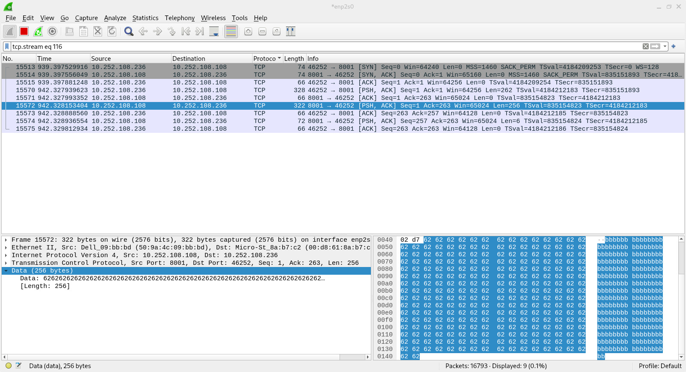
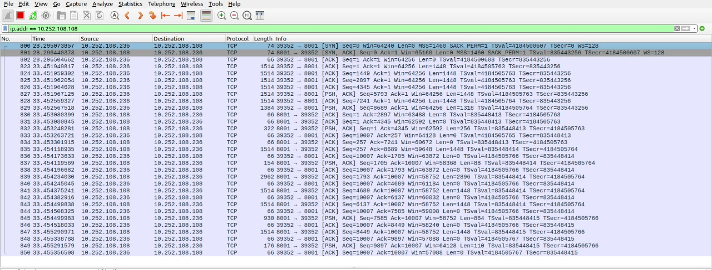

#  C Socket Programming: Simple Server and Client

### 1. Apa yang dimaksud dengan Socket?

-   Dengan socket, dua proses yang berbeda dapat saling berkomunikasi
-   Socket tidak lain adalah sebuah `file`
-   Anda dapat membayangkan bahwa dua proses yang berbeda memiliki file (socket) dan mereka membaca data yang diterima dari socket dan menulis ke socket untuk mengirim data ke jaringan
-   Jadi, socket memiliki deskriptor file, yang merupakan sebuah bilangan bulat untuk mengidentifikasi file yang dibuka

### 2. Jenis Socket
Terdapat dua jenis socket yang umum digunakan, yaitu `Socket Stream` dan `Socket Datagram`. Socket stream menggunakan TCP untuk transmisi data, dan socket Datagram menggunakan UDP.

### 3. Proses Klien & Proses Server

#### Client : Biasanya meminta informasi ke server.

-   Buat socket dengan panggilan sistem `socket()`
-   Menghubungkan socket ke alamat server dengan menggunakan system call `connect()`
-   Mengirim dan menerima data. Ada beberapa cara untuk melakukan hal ini, tetapi cara yang paling sederhana adalah dengan menggunakan panggilan sistem `read()` dan `write()`

#### Server : Mengambil permintaan dari client, melakukan pemrosesan yang diperlukan, dan mengirimkannya ke client

-   Buat socket dengan panggilan sistem `socket()`
-   Mengikat socket ke sebuah alamat (IP + port) dengan menggunakan panggilan sistem `bind()`
-   Mendengarkan koneksi dengan panggilan sistem `listen()`
-   Menerima sambungan dengan panggilan sistem `accept()`. Panggilan ini biasanya memblokir koneksi sampai client terhubung dengan server
-   Mengirim dan menerima data menggunakan panggilan sistem `read()` dan `write()`

## Server

> Sebelum meng-compile & run file, pastikan menggunakan linux.

`Mengganti port number agar sama dengan client :`

    int  main(  int  argc,  char  *argv[]  ) {
	    const  uint16_t  port_number  =  10001;
	    int  server_fd  =  socket(AF_INET, SOCK_STREAM, 0);
	    ...
	}

## Client

> Sebelum meng-compile & run file, pastikan menggunakan linux.

`Mengganti port number agar sama dengan client dan server ip dari network server yang bisa dilihat dengan ipconfig :`

    int  main(int  argc,  char  *argv[]) {
	    int  sockfd, portno, n;
	    struct  sockaddr_in  serv_addr;
	    struct  hostent  *server;
	    char  buffer[256];
	    portno  =  10001;
	    ...
	    server  =  gethostbyname("10.252.130.156");
	    ...
	}

## Run

 1. Buka terminal dan navigasi ke folder file socket
 2. Compile dan run file server.c
 3. Buka halaman terminal baru atau komputer lain, lalu compile dan run file client.c
 4. Ketik pada terminal client.c dan akan keluar pada terminal server.c (dengan menambahkan kode inputan dari server.c, kita dapat berkomunikasi antar client dan server)

**OUTPUT**

## Analisis

Dalam contoh pemrograman socket sederhana di mana client mengirim pesan ke server, dan server merespons, perilaku tipikal yang terjadi adalah Full Closed Connection Termination. Inilah alasannya:

 1. **Komunikasi Client-Server** : Dalam skenario yang dijelaskan, client memulai komunikasi dengan mengirim pesan ke server. Pesan ini sering kali dikirim melalui koneksi socket TCP.
 2. **Server Response** : Setelah menerima pesan, server memprosesnya dan kemudian mengirimkan respons kembali ke client. Tanggapan ini juga dikirim melalui koneksi TCP yang sama.
 3. **Connection Termination** : Setelah client dan server saling bertukar pesan, mereka biasanya menutup koneksi dengan baik. Dalam program yang dirancang dengan baik, client atau server dapat memulai proses pemutusan koneksi ini dengan mengirimkan paket TCP FIN, yang mengindikasikan niat mereka untuk menutup koneksi. Pihak lain akan menerima paket FIN tersebut, dan ketika kedua belah pihak telah menerima paket FIN tersebut, maka koneksi dianggap telah ditutup sepenuhnya.
 4. **Full CLosed** : Dalam skenario ini, baik client dan server telah menyelesaikan pertukaran data mereka dan telah mengindikasikan niat mereka untuk mengakhiri koneksi. Oleh karena itu, ini mengikuti pola pemutusan koneksi tertutup penuh.

## Analisis Wireshark

> Mencari berapa banyak segmentasi dan panjang bytes yang dikirim pada sekali segmentasi pada transfer kata yang dikirim dari client ke server dengan mengikuti TCP Stream.

Melakukan beberapa percobaan dengan mengirimkan beberapa length data yang dikirim dari client kemudian melihat berapa kali segmentasi terjadi.

Seperti yang kita lihat dari salah satu segment di gambar terakhir bahwa setiap segmentasi membawa sebesar 256 bytes.

Perlu diketahui bahwa segmentasi tidak selalu membawa sebesar 256 bytes, segmentasi tersebut juga bisa membawa sebesar 500 bytes, 1000 bytes seperti contoh di bawah :

Kita bisa melihat terdapat segmentasi yang membawa sebesar 1400 bytes, 1300 bytes, 2800 bytes, 800 bytes, 100 bytes, dan lainnya.

Salah satu alasan mengapa segmen-segmen dapat membawa jumlah byte yang berbeda adalah sebagai berikut:

Maksimum Segment Size (MSS): Setiap segmen TCP memiliki batasan maksimum dalam jumlah byte yang dapat diangkut, yang disebut MSS. Batasan ini dapat berbeda-beda tergantung pada beberapa faktor seperti MTU (Maximum Transmission Unit) pada jaringan fisik yang digunakan, konfigurasi perangkat jaringan, dan negosiasi MSS antara pengirim (client) dan penerima (server) selama proses awal koneksi. Karena nilai MSS bisa bervariasi, segmen-segmen yang dihasilkan dalam satu koneksi TCP dapat memiliki ukuran yang berbeda-beda.

Fragmentation: Selain MSS, faktor lain yang dapat mempengaruhi ukuran segmen adalah fragmentasi. Fragmentasi terjadi ketika sebuah segmen TCP yang besar harus dipecah-pecah menjadi potongan-potongan yang lebih kecil saat melewati jaringan yang memiliki batasan MTU yang lebih kecil. Setiap potongan ini adalah segmen yang berbeda dengan ukuran yang berbeda, dan penerima harus menerima dan menyusun kembali potongan-potongan ini untuk mendapatkan data lengkap.

Kehilangan Paket: Terkadang, dalam situasi jaringan yang tidak stabil atau penuh, segmen-segmen dapat hilang dalam perjalanan. Ketika segmen hilang, pengirim akan mengirim ulang segmen tersebut. Ini dapat menyebabkan adanya duplikasi segmen yang mengakibatkan beberapa segmen memiliki jumlah byte yang berbeda dalam rentang waktu tertentu.

Prioritasi: Dalam beberapa implementasi jaringan atau protokol, segmen-segmen yang memiliki prioritas yang berbeda dapat memiliki ukuran yang berbeda-beda. Misalnya, dalam QoS (Quality of Service), segmen-segmen dengan prioritas tinggi dapat memiliki ukuran yang lebih kecil untuk memastikan pengiriman yang cepat.

Jadi, perbedaan dalam jumlah byte yang dibawa oleh segmen-segmen dalam proses segmentasi adalah hasil dari banyak faktor yang berpengaruh pada komunikasi jaringan, seperti pengaturan protokol, batasan fisik jaringan, dan kondisi jaringan saat itu.