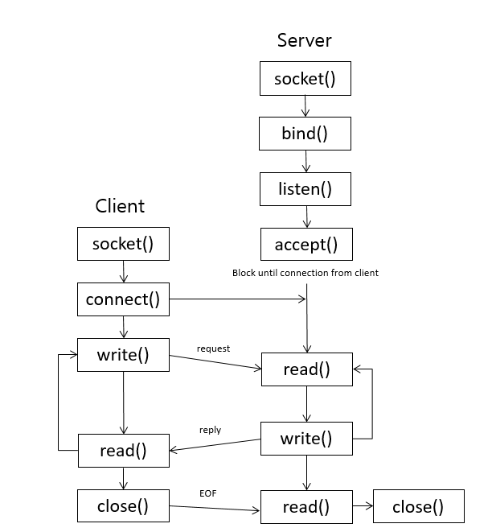

#  C Socket Programming: Simple Server and Client

### 1. Apa yang dimaksud dengan Socket?

-   Dengan socket, dua proses yang berbeda dapat saling berkomunikasi
-   Socket tidak lain adalah sebuah `file`
-   Anda dapat membayangkan bahwa dua proses yang berbeda memiliki file (socket) dan mereka membaca data yang diterima dari socket dan menulis ke socket untuk mengirim data ke jaringan
-   Jadi, socket memiliki deskriptor file, yang merupakan sebuah bilangan bulat untuk mengidentifikasi file yang dibuka

### 2. Jenis Socket
Terdapat dua jenis socket yang umum digunakan, yaitu `Socket Stream` dan `Socket Datagram`. Socket stream menggunakan TCP untuk transmisi data, dan socket Datagram menggunakan UDP.

### 3. Proses Klien & Proses Server

#### Client : Biasanya meminta informasi ke server.

-   Buat socket dengan panggilan sistem `socket()`
-   Menghubungkan socket ke alamat server dengan menggunakan system call `connect()`
-   Mengirim dan menerima data. Ada beberapa cara untuk melakukan hal ini, tetapi cara yang paling sederhana adalah dengan menggunakan panggilan sistem `read()` dan `write()`

#### Server : Mengambil permintaan dari client, melakukan pemrosesan yang diperlukan, dan mengirimkannya ke client

-   Buat socket dengan panggilan sistem `socket()`
-   Mengikat socket ke sebuah alamat (IP + port) dengan menggunakan panggilan sistem `bind()`
-   Mendengarkan koneksi dengan panggilan sistem `listen()`
-   Menerima sambungan dengan panggilan sistem `accept()`. Panggilan ini biasanya memblokir koneksi sampai client terhubung dengan server
-   Mengirim dan menerima data menggunakan panggilan sistem `read()` dan `write()`

## Server

> Sebelum meng-compile & run file, pastikan menggunakan linux.

`Mengganti port number agar sama dengan client :`

    int  main(  int  argc,  char  *argv[]  ) {
	    const  uint16_t  port_number  =  10001;
	    int  server_fd  =  socket(AF_INET, SOCK_STREAM, 0);
	    ...
	}

## Client

> Sebelum meng-compile & run file, pastikan menggunakan linux.

`Mengganti port number agar sama dengan client dan server ip dari network server yang bisa dilihat dengan ipconfig :`

    int  main(int  argc,  char  *argv[]) {
	    int  sockfd, portno, n;
	    struct  sockaddr_in  serv_addr;
	    struct  hostent  *server;
	    char  buffer[256];
	    portno  =  10001;
	    ...
	    server  =  gethostbyname("10.252.130.156");
	    ...
	}

## Run

 1. Buka terminal dan navigasi ke folder file socket
 2. Compile dan run file server.c
 3. Buka halaman terminal baru atau komputer lain, lalu compile dan run file client.c
 4. Ketik pada terminal client.c dan akan keluar pada terminal server.c (dengan menambahkan kode inputan dari server.c, kita dapat berkomunikasi antar client dan server)

**OUTPUT**

