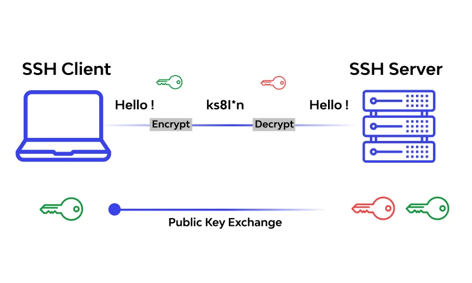

#  SSH (Secure Shell)

#### Pengertian
SSH adalah protokol jaringan yang digunakan untuk mengakses perangkat dan sistem jarak jauh dengan aman. Ini menggantikan Telnet dalam banyak kasus karena menyediakan enkripsi data dan otentikasi kuat.

#### RFC
SSH diatur oleh beberapa RFC, termasuk RFC 4251 hingga RFC 4254, yang mencakup berbagai aspek protokol SSH.

#### Karakteristik :
1. Menggunakan enkripsi untuk melindungi data yang dikirimkan antara klien dan server, menjadikannya lebih aman daripada Telnet.
2. Mendukung otentikasi kuat, termasuk penggunaan kunci kriptografi, serta username dan password.
3. Digunakan secara luas untuk mengakses server jarak jauh dan juga digunakan dalam transfer file melalui SCP (Secure Copy) dan SFTP (SSH File Transfer Protocol).

#### Cara Kerja :
1. SSH menggunakan teknik enkripsi untuk melindungi data yang dikirimkan antara client dan server. Ini menjadikannya aman dari serangan perekaman dan pengintai.
2. Client dan server memiliki kunci kriptografi yang digunakan untuk mengamankan komunikasi.
3. Selain otentikasi berbasis kata sandi, SSH juga mendukung otentikasi berbasis kunci, yang lebih kuat.

#### Keunggulan
SSH menyediakan lapisan keamanan yang tinggi dengan mengenkripsi data yang dikirimkan melalui jaringan SSH juga mendukung berbagai metode otentikasi, seperti kunci kriptografi, sehingga memastikan bahwa hanya pengguna yang sah yang dapat mengakses sistem. Tidak hanya itu, SSH juga digunakan untuk transfer file melalui SCP (Secure Copy) dan SFTP (SSH File Transfer Protocol)