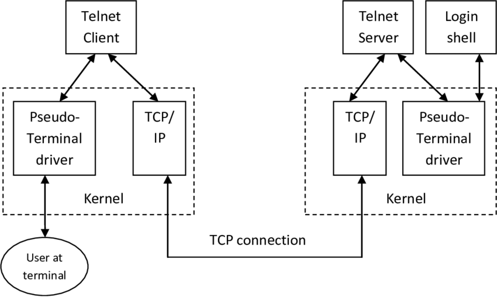

#  Telnet

#### Pengertian
Telnet adalah protokol jaringan yang digunakan untuk mengakses jarak jauh ke perangkat dan sistem yang terhubung ke jaringan. Ini adalah protokol yang digunakan untuk mengontrol perangkat jarak jauh seperti server melalui koneksi teks melalui jaringan

#### RFC
Telnet diatur oleh RFC 854, yang disebut "Telnet Protocol Specification".

#### Karakteristik :
1. Menggunakan koneksi teks (tanpa enkripsi), sehingga rentan terhadap serangan dan tidak aman jika digunakan melalui jaringan publik.
2. Memungkinkan pengguna untuk melakukan login ke perangkat jarak jauh dan menjalankan perintah melalui antarmuka teks.
3. Telnet tidak memadai untuk mengakses perangkat atau sistem yang memerlukan keamanan tinggi karena tidak menyediakan enkripsi data.

#### Cara Kerja :
1. Telnet bekerja dengan mengirimkan perintah dan data dalam bentuk teks dari client ke server yang berjalan Telnet Server software.
2. Server menerima perintah tersebut, menginterpretasikan mereka, dan mengirimkan balasan dalam bentuk teks kemabli ke client.
3. Komunikasi dalam Telnet tidak dienkripsi, sehingga informasi yang dikirimkan antara client dan server dapat dengan mudah diakses oleh pihak ketiga jika mereka dapat mengakses jalur komunikasi.

#### Kelemahan :
Telnet tidak aman untuk digunakan dalam mengirim informasi, karena tidak ada enkripsi yang terlibat, informasi yang dikirim melalui Telnet rentan terhadap penyalahgunaan oleh penyerang.