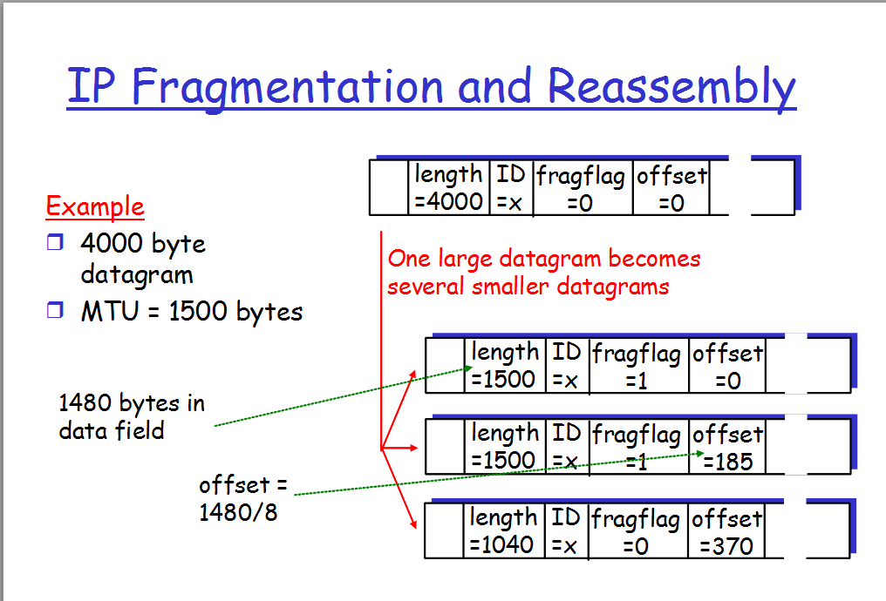

# IP FRAGMENTATION
  
### **IP Service Model**:

IP (Internet Protocol) Service Model adalah cara protokol IP mengelola dan mengirimkan data melalui jaringan. Model ini didasarkan pada prinsip-prinsip dasar berikut:

1.  **Best Effort Delivery**: IP adalah protokol "Best Effort," yang berarti bahwa ia akan mencoba sebaik mungkin untuk mengirimkan paket-paket data, tetapi tidak menjamin pengiriman yang berhasil, pengiriman dalam urutan, atau latensi yang konsisten.
    
2.  **Connectionless**: IP adalah protokol koneksi tanpa koneksi, yang berarti setiap paket diangkut secara independen, tanpa perlu membuat koneksi sebelumnya atau menjaga status koneksi saat ini.
    
3.  **Unreliable**: IP tidak memiliki mekanisme bawaan untuk mendeteksi atau memperbaiki kesalahan pengiriman, dan tidak menjamin pengiriman paket tanpa kesalahan.

### **IPv4 Header Fields**:

Header IPv4 adalah bagian dari setiap paket IPv4 dan berisi informasi penting tentang pengiriman paket. Berikut adalah beberapa bidang kunci dalam header IPv4:

1.  **Version**: Menyatakan versi protokol IP, misalnya, IPv4 atau IPv6.
    
2.  **IHL (Internet Header Length)**: Menyatakan panjang header dalam kata-kata 32-bit (biasanya 5 kata atau 20 byte).
    
3.  **Type of Service (TOS)**: Awalnya digunakan untuk menentukan prioritas dan tipe layanan paket, tetapi sekarang sebagian besar tidak digunakan.
    
4.  **Total Length**: Menyatakan panjang seluruh paket (header dan data) dalam byte.
    
5.  **Identification, Flags, Fragment Offset**: Digunakan dalam proses fragmentasi paket (jika diperlukan) dan reassemblage. Mereka membantu mengidentifikasi dan mengatur paket-paket yang telah dipecah.
    
6.  **Time to Live (TTL)**: Menyatakan berapa lama paket boleh berada dalam jaringan sebelum dihapus. Ini membantu mencegah paket terjebak dalam loop tak terbatas.
    
7.  **Protocol**: Menunjukkan protokol lapisan atas yang akan menerima paket (misalnya, TCP, UDP, atau ICMP).
    
8.  **Header Checksum**: Menyediakan kesalahan deteksi header untuk memastikan integritas header.
    
9.  **Source IP Address** dan **Destination IP Address**: Menyatakan alamat IP pengirim dan penerima.
    
10.  **Options**: Bidang opsional yang memungkinkan penyesuaian atau fungsi tambahan dalam header.
  

### **IP Delivery Model**:

IP Delivery Model menggambarkan bagaimana paket IP dikirimkan dari sumber ke tujuan. Ini beroperasi dengan cara berikut:

1.  **Routing**: Router di seluruh jaringan mengambil keputusan tentang rute terbaik untuk mengirim paket berdasarkan alamat tujuan dalam header IP.
    
2.  **Forwarding**: Router meneruskan paket ke tujuan sesuai dengan keputusan yang dibuat dalam proses routing.
    
3.  **Best Effort**: IP tidak menjamin pengiriman paket dalam urutan, pengiriman yang berhasil, atau tingkat layanan tertentu. Ini hanya akan mencoba untuk mengirimkan paket secepat dan sebaik mungkin.
 

### **IP Fragmentation and Reassembly**:

-   **Fragmentasi**: Ketika sebuah paket IP melewati jaringan dengan MTU yang lebih rendah (Maximum Transmission Unit), paket itu dapat dipecah menjadi beberapa fragmen yang lebih kecil. Header IP asli tetap dalam fragmen pertama, dan fragmen-fragmen lainnya memiliki header tambahan yang menyatakan informasi tentang fragmentasi.
    
-   **Reassembly**: Penerima mengumpulkan fragmen-fragmen ini kembali menjadi paket lengkap. Reassembly dilakukan berdasarkan informasi dalam header setiap fragmen, seperti identifikasi, flag, dan offset fragmen. Setelah semua fragmen tiba dan dirakit, paket lengkap dapat diproses oleh lapisan di atasnya (seperti TCP atau UDP).

  
Fragmentasi dan reassembly berguna saat paket-paket yang besar harus melewati jaringan dengan batasan MTU yang lebih rendah, seperti ketika data melewati melalui jaringan yang berbeda. Namun, fragmentasi dapat menambah overhead dan mengurangi efisiensi pengiriman data, sehingga seringkali dihindari ketika memungkinkan.
  
