`Tugas ini merupakan tugas mata kuliah Konsep Jaringan yang dibimbing oleh Bpk. Dr. Ferry Astika Saputra,ST, M.Sc`

# PACKET TRACER
  

    

    PING KE SEMUA PC DENGAN BERBEDA ROUTER
    

1. Lihat desain dan buat desainnya. Anda dapat membuat desainnya dengan memilih alat-alat yang sesuai.
   
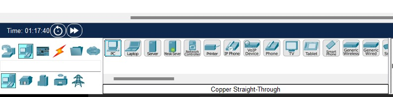

2. Setting router 0
   
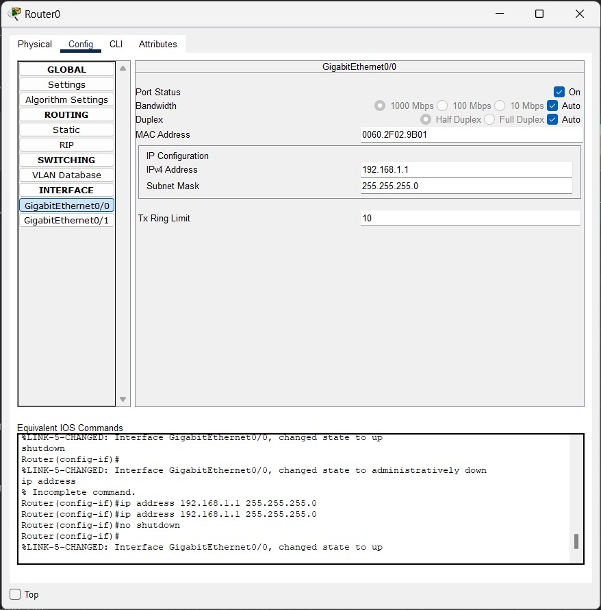

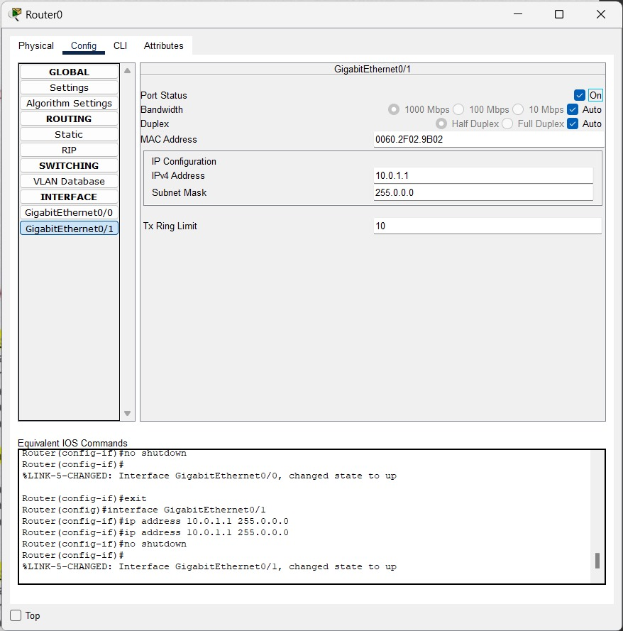

3. Setting router 1
   
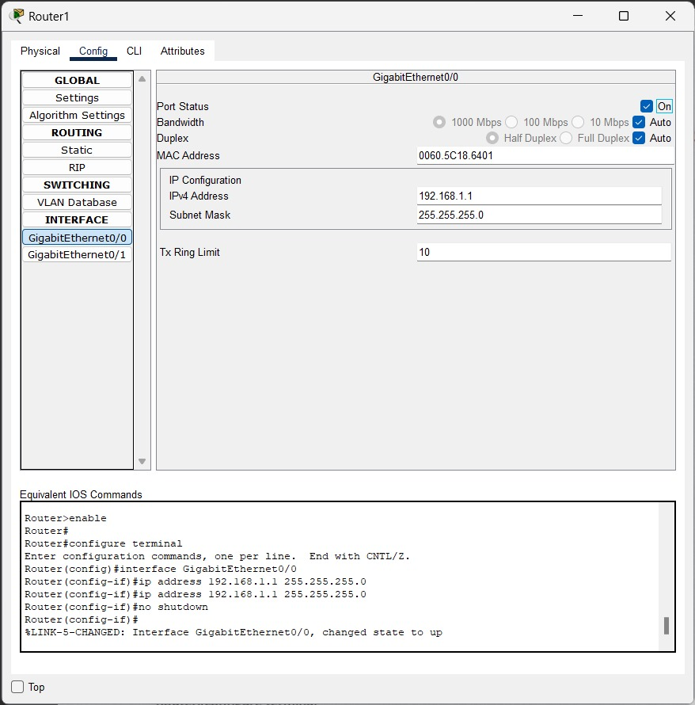

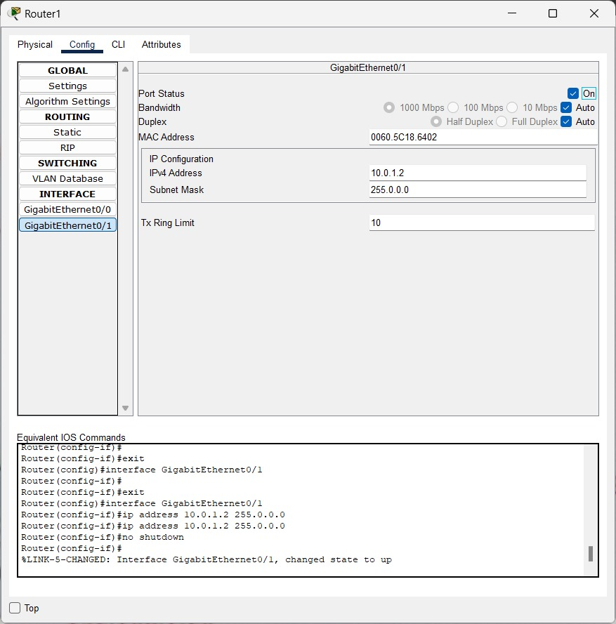

4. Setting PC 1

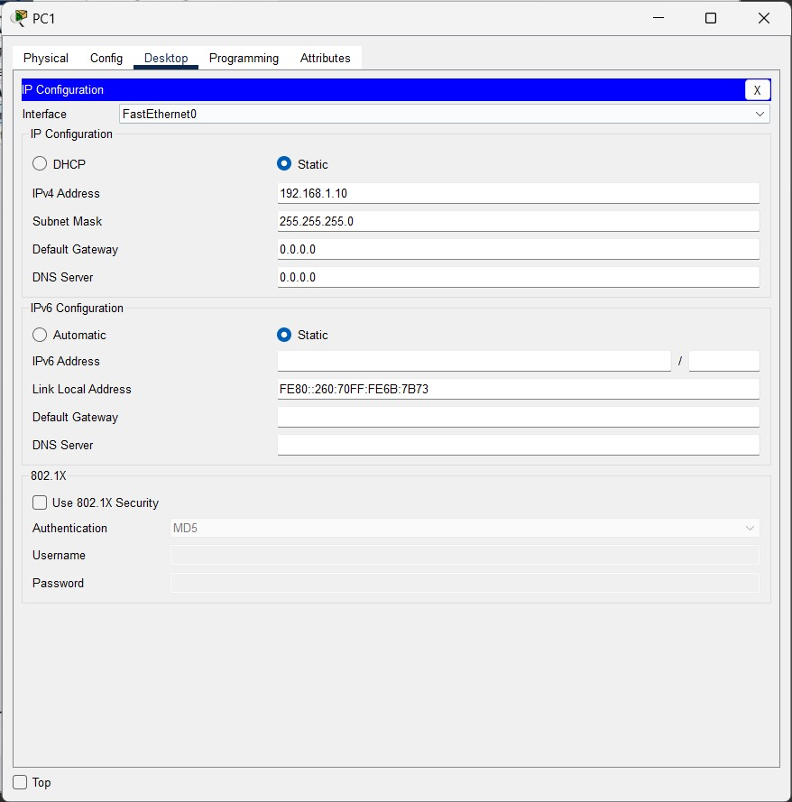

5. Setting PC 2
    
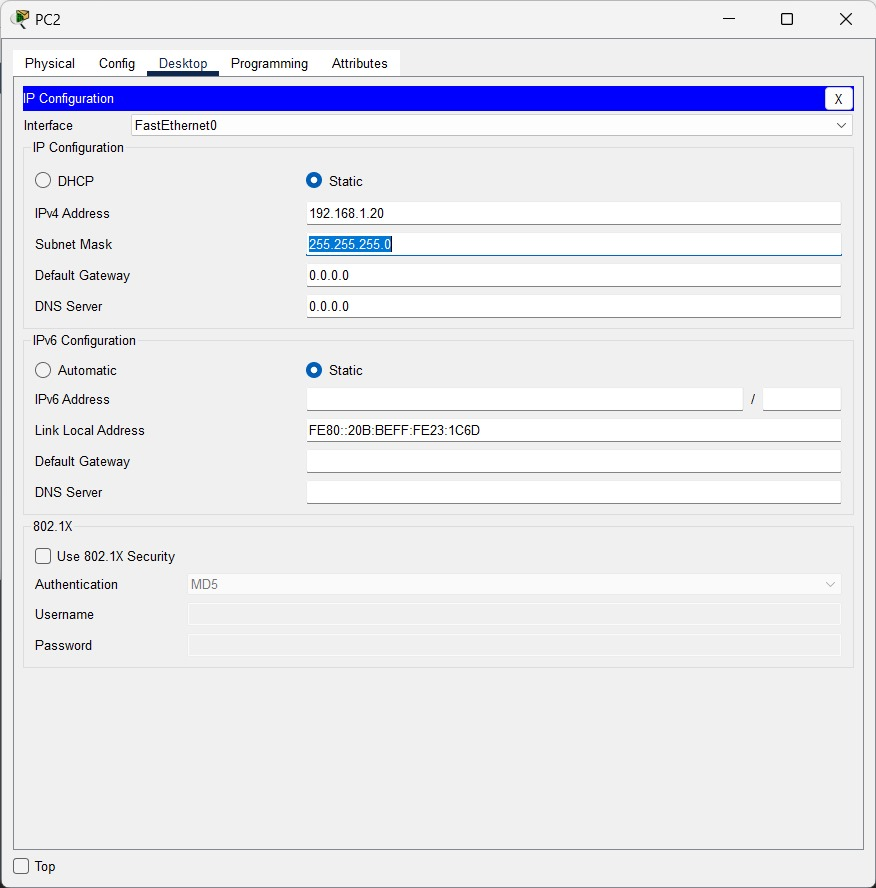

6. Setting PC 3

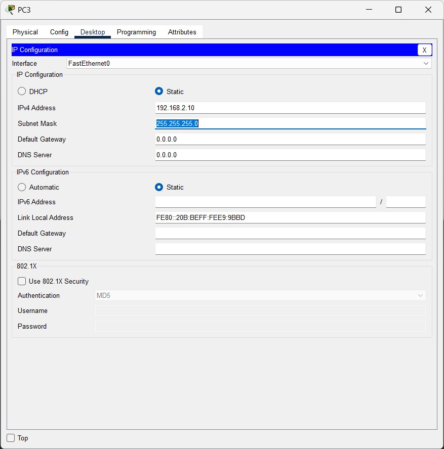

7. Setting PC 4
    
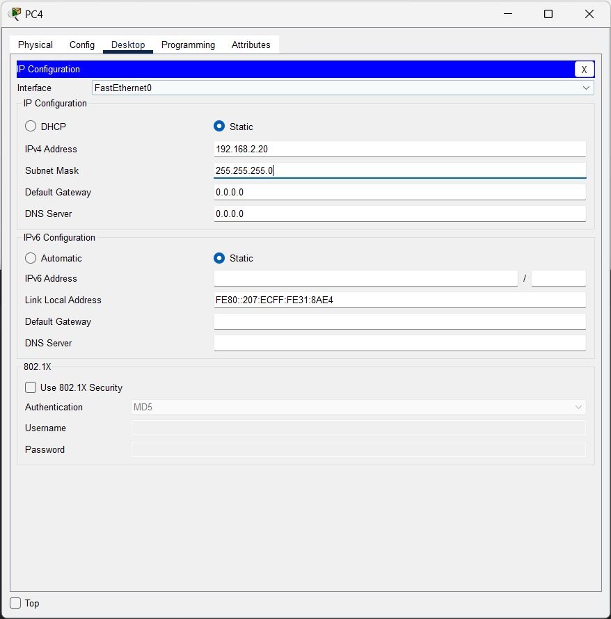

8. Tambahkan routing statis pada Router 0
    
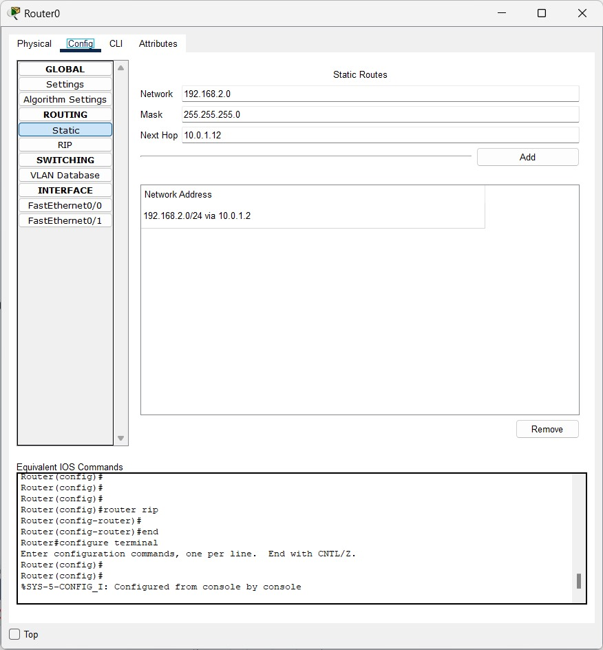

9. Tambahkan routing statis pada Router 1
    
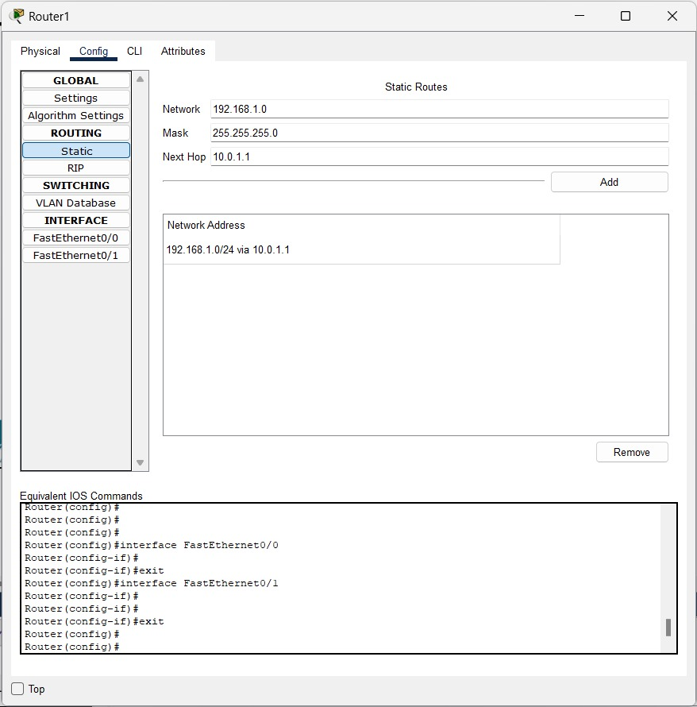

10. Koneksikan semua periferal
    
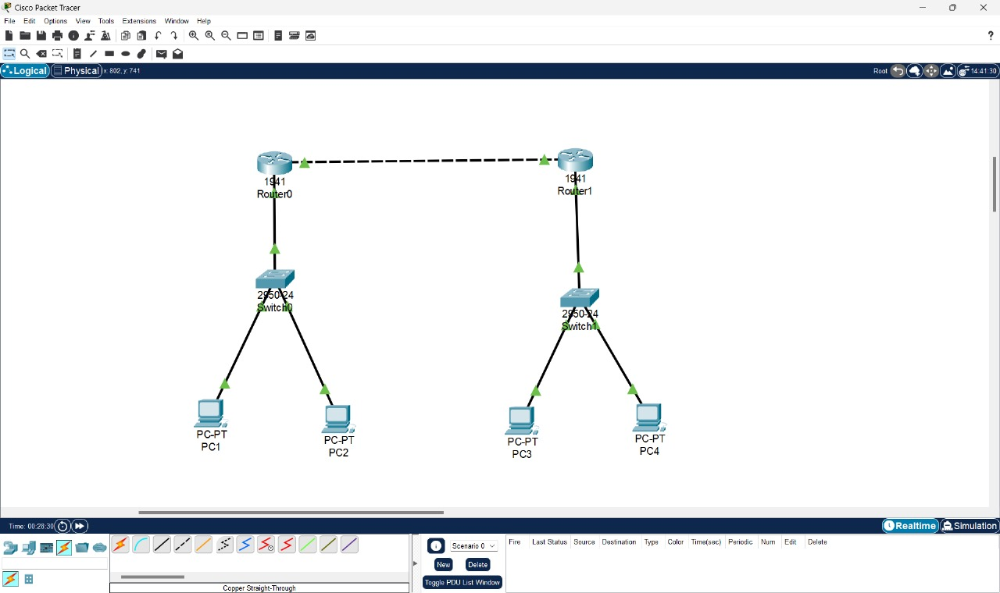

11. Masuk ke salah satu PC dan ping PC yang lainnya
    
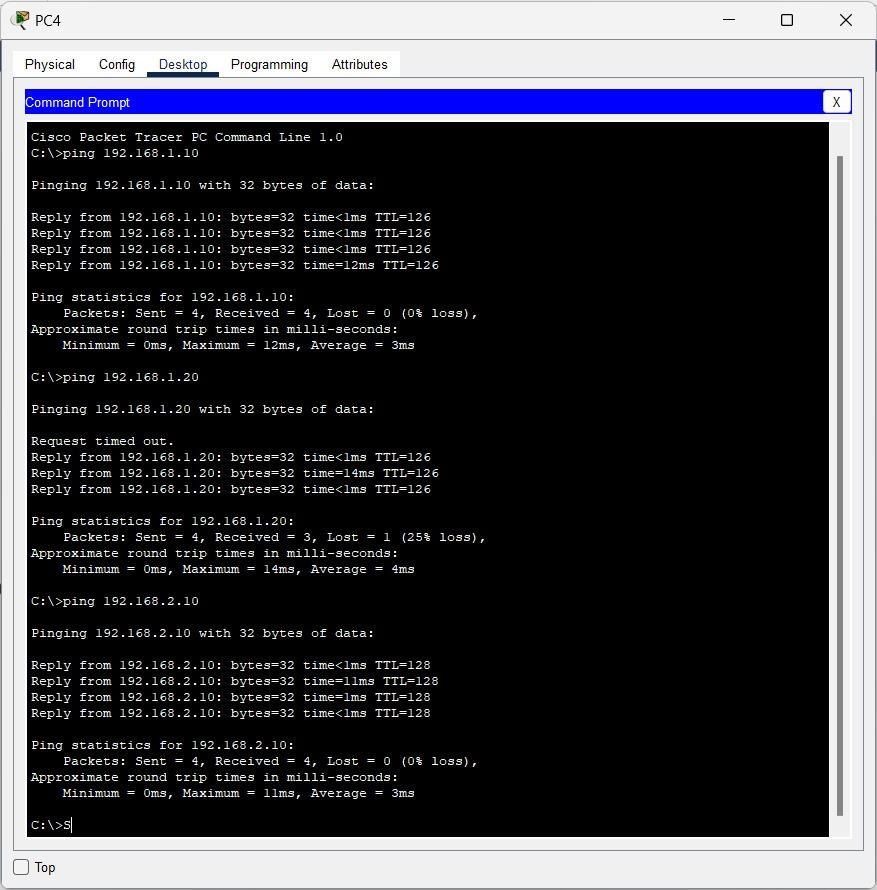
