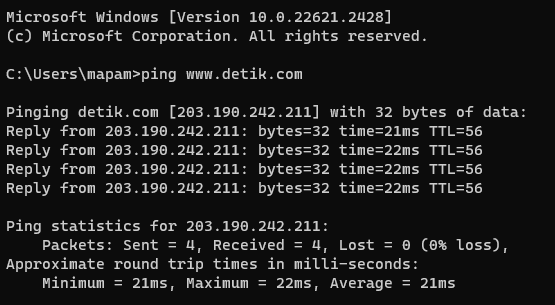
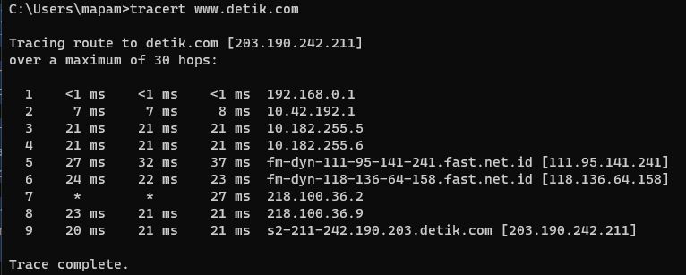

`Tugas ini merupakan tugas mata kuliah Konsep Jaringan yang dibimbing oleh Bpk. Dr. Ferry Astika Saputra,ST, M.Sc`

# tracert
  
tracert atau traceroute adalah perintah yang digunakan untuk melacak rute yang diambil oleh paket data saat mencoba mencapai tujuan tertentu di jaringan komputer. 

Saat menjalankan perintah tersebut, kita akan mendapatkan output yang menampilkan beberapa kolom. Berikut adalah fungsi dari tiap kolom tersebut.

-   **Hop Number (Nomor Hop)**: Ini adalah urutan hop atau lompatan yang dilakukan oleh paket data untuk mencapai tujuan. Setiap baris dalam hasil tracert menunjukkan satu hop atau lompatan.
    
-   **Round-Trip Time (RTT)**: Ini adalah waktu yang diperlukan oleh paket data untuk pergi dari komputer pengirim ke hop tertentu dan kembali lagi ke komputer pengirim. RTT diukur dalam milidetik (ms). RTT memberikan gambaran tentang latensi atau jeda waktu dalam perjalanan paket data.
    
-   **IP Address (Alamat IP)**: Ini adalah alamat IP dari hop tertentu dalam perjalanan paket data. Alamat IP ini dapat membantu mengidentifikasi perangkat atau node jaringan yang digunakan dalam rute.
    
-   **Host Name (Nama Host)**: Ini adalah nama host atau nama perangkat pada hop tertentu dalam perjalanan paket data. Beberapa hop mungkin menampilkan nama host, sementara yang lain hanya menampilkan alamat IP jika nama host tidak dapat diidentifikasi.

## PING && TRACERT

Kita mendapatkan mengirimkan paket data ke alamat 203.190.242.211 yang berupoa alamat IP dari situs detik.com. Berikut penjelasan dari hasil ping tersebut :

-   "Pinging detik.com [203.190.242.211] with 32 bytes of data:": Ini adalah pesan yang menunjukkan bahwa komputer kita sedang mengirimkan paket data sebesar 32 byte ke alamat IP 203.190.242.211.
    
-   "Reply from 203.190.242.211: bytes=32 time=21ms TTL=56": Ini adalah balasan dari alamat IP 203.190.242.211. Balasan ini menunjukkan bahwa paket data sebesar 32 byte telah berhasil diterima oleh server di alamat IP tersebut. Waktu yang dibutuhkan untuk perjalanan bolak-balik (round-trip time) adalah 21 milidetik (ms). TTL (Time-To-Live) adalah 56, yang menunjukkan jumlah hop yang tersisa sebelum paket data dihapus dari jaringan.
    
-   "Ping statistics for 203.190.242.211: Packets: Sent = 4, Received = 4, Lost = 0 (0% loss),": Ini adalah statistik ping yang menunjukkan bahwa kita mengirimkan 4 paket data (Sent = 4), semuanya berhasil diterima oleh server (Received = 4), dan tidak ada paket data yang hilang (Lost = 0). Persentase kehilangan paket adalah 0%, yang merupakan hasil yang baik dan menunjukkan koneksi jaringan yang stabil.
    
-   "Approximate round trip times in milli-seconds: Minimum = 21ms, Maximum = 22ms, Average = 21ms": Ini adalah statistik rata-rata waktu perjalanan bolak-balik dari komputer kita ke alamat IP 203.190.242.211. Waktu tercepat (Minimum) adalah 21 ms, waktu terlama (Maximum) adalah 22 ms, dan rata-rata waktu perjalanan adalah 21ms.

Hasil tracert yang kita berikan menunjukkan percobaan melacak rute paket data dari komputer kita ke alamat IP 203.190.242.211, yang merupakan server detik.com. Di sini, setiap baris dalam output mewakili satu hop dalam perjalanan paket data. Mari jelaskan hasilnya:

-   "Tracing route to detik.com [203.190.242.211] over a maximum of 30 hops": Pesan ini menunjukkan bahwa komputer kita sedang mencoba melacak rute ke alamat IP 203.190.242.211 melalui maksimal 30 hop (lompatan).
    
-   `1 ms <1 ms <1 ms 192.168.0.1`: Ini adalah langkah pertama atau hop pertama dalam perjalanan paket data. Alamat IP 192.168.0.1 adalah router atau gateway pertama yang digunakan dalam jaringan lokal Anda. Waktu respons (latensi) sangat rendah, sekitar 1 milidetik (ms).
    
-  `27 ms 32 ms 37 ms fm-dyn-111-95-141-241.fast.net.id [111.95.141.241]`: Hop kelima adalah alamat IP 111.95.141.241, yang merupakan alamat luar dari ISP kita. Waktu respons mulai meningkat di sini, mungkin karena jaringan yang lebih luas.
    
-    `24 ms 22 ms 23 ms fm-dyn-118-136-64-158.fast.net.id [118.136.64.158]`: Hop keenam adalah alamat IP 118.136.64.158, yang juga merupakan bagian dari infrastruktur ISP. Waktu respons kembali menurun sedikit.
 
- `* * 27 ms 218.100.36.2`: Hop ketujuh memiliki tanda "*" yang menunjukkan bahwa tidak ada respon dari node ini. Ini mungkin karena node tersebut mengabaikan permintaan ICMP yang digunakan oleh tracert.

- `20 ms 21 ms 21 ms s2-211-242.190.203.detik.com [203.190.242.211]`: Ini adalah hop terakhir sebelum mencapai server detik.com dengan alamat IP 203.190.242.211. Waktu respons tetap rendah, menunjukkan bahwa Anda telah mencapai tujuan akhir.
    
-   Setelah hop terakhir, pesan "Trace complete" menandakan bahwa tracert telah menyelesaikan pelacakan rute ke detik.com.
