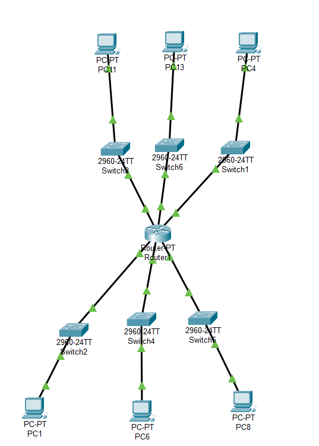

# Subnet

Di sini kita akan subnet IP public menjadi 6 subnet menggunakan Cisco Packet Tracer.

IP Public: 12.0.0.0/8

Untuk mengubah IP tersebut menjadi 6 subnet, kita harus mengubah netmasknya. Netmask menentukan seberapa banyak bit yang digunakan untuk mengidentifikasi jaringan dalam alamat IP.

Pada IP tersebut, 8 bit pertama adalah bagian dari Network Address dan 24 bit terakhir adalah bagian yang dapat digunakan untuk Host. Jika kita tulis dalam format biner, ini adalah netmasknya: 11111111.00000000.00000000.00000000. 8 bit pertama adalah 1 (dalam notasi biner), 24 sisanya adalah 0. Jadi netmask dalam desimal adalah 255.0.0.0.

Kita kan akan membuat 6 subnet, jadi kita perlu menambahkan 3 bit ke netmask karena 2^3 = 8 (kita mencari nilai yang paling dekat dengan jumlah subnetnya).

-   Netmask awal: 255.0.0.0 atau 11111111.00000000.00000000.00000000
-   Netmask sesudah: 255.224.0.0 atau 11111111.11100000.00000000.00000000 (bertambah 3 bit).

Hasilnya adalah: 12.0.0.0/11 dengan netmask 255.224.0.0.

Lalu kita dapat membuat 6 subnet yang berbeda sebagai berikut:

-   Subnet 1: 12.0.0.0/11
-   Subnet 2: 12.32.0.0/11
-   Subnet 3: 12.64.0.0/11
-   Subnet 4: 12.96.0.0/11
-   Subnet 5: 12.128.0.0/11
-   Subnet 6: 12.160.0.0/11

Nah karena sudah dapat hasil perhitungannya, kita bisa langsung membuatnya di Packet Tracer. Kita membutuhkan 1 router dan 6 switch di mana masing-masing switch terdapat 1 PC. Lalu kita akan menghubungkannya menggunakan kabel Copper Straight-Through.

