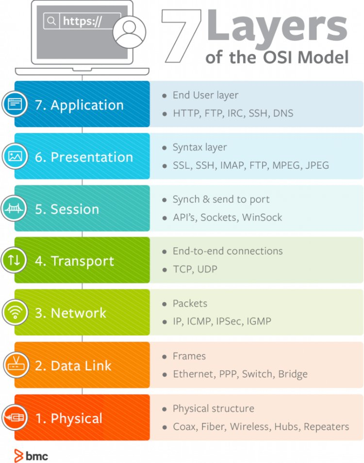

<h1>Penjelasan Layers OSI</h1>

 

Nama  : Mahargi Anugerahwan Pamungkas

Kelas : 2 D4 IT A

NRP   : 3122600012

 

  

OSI merupakan singkatan dari "Open System Interconnection. Ini adalah kerangka kerja atau model yang digunakan untuk menggambarkan cara komunikasi jaringan komputer terjadi. OSI menggambarkan tujuh lapisan berbeda yang mencakup berbagai fungsi yang terlibat dalam komunikasi jaringan.

 

Tujuh lapisan OSI tersebut ialah

<ul>
  <li>Application</li>
  <li>Presentation</li>
  <li>Session</li>
  <li>Transport</li>
  <li>Network</li>
  <li>Data Link</li>
  <li>Physical</li>
</ul>

 

<h3>Penjelasan Masing-Masing Layers</h3>

<ul>
  <li>
    Application 
    

      Ini adalah lapisan teratas yang berinteraksi langsung dengan pengguna dan aplikasi. Lapisan ini menyediakan layanan dan protokol untuk aplikasi komunikasi, seperti HTTP untuk browsing web, FTP untuk transter file, dll.
    

  </li>
   
  <li>
    Presentation 
    

      Lapisan ini menangani konversi, enkripsi, dan kompresi data agar dapat diinterpretasikan dengan benar oleh perangkat penerima. Ini memastikan bahwa data yang dikirimkan dari aplikasi pengirim dapat dipahami oleh aplikasi penerima.
    

  </li>
   
  <li>
    Session 
    

      Lapisan ini mengelola pembuatan, pemeliharaan, dan penutupan sesi komunikasi antara perangkat. Ini memungkinkan penggunaan multipleksing (mengirimkan data dari beberapa aplikasi secara bersamaan) dan sinkronisasi antara perangkat. 
    

  </li>
   
  <li>
    Transport 
    

      Lapisan ini bertanggung jawab atas pengaturan koneksi antara perangkat pengirim dan penerima serta pengelolaan aliran data. Lapisan ini memecah pesan menjadi segmen-segmen yang lebih kecil dan mengelola pengiriman ulang jika terjadi kerusakan atau hilangnya segmen.
    

  </li>
   
  <li>
    Network 
    

      Lapisan ini mengatur pengiriman paket data melalui jaringan yang mmungkin terdidi dari banyak perangkat dan rute. Lapisan Jaringan menggunakan alamat IP untuk mengarahkan paket ke tujuan yang benar dan mengelola routing yang memutuskan jalur terbaik untuk pengiriman data.
    

  </li>
   
  <li>
    Data Link 
    

      Lapisan ini mengatur aliran data antara perangkat di jaringan yang berdekatan. Ini juga bertugas mendeteksi dan memperbaiki kesalahan yang mungkin terjadi selama transmisi data. Lapisan ini dibagi menjadi dua sublapisan : 
      <ul>
        <li>MAC (Media Access Control) yang mengatur akses ke media bersama</li>
        <li>LLC (Logical Link Control) yang mengelola aliran data</li>
      </ul>
    

  </li>
   
  <li>
    Physical 
    

    Ini adalah lapisan terbawah yang bertanggung jawab atas transmisi sinyal fisik melalui media komunikasi, seperti kabel dan gelombang radio. Lapisan ini mengatur detail teknis seperti tegangan, frekuensi, dan jenis koneksi fisik antara perangkat.
    

  </li>
</ul>
