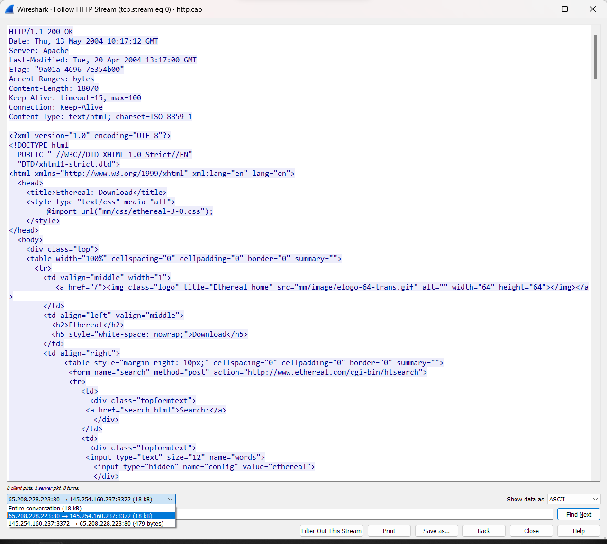
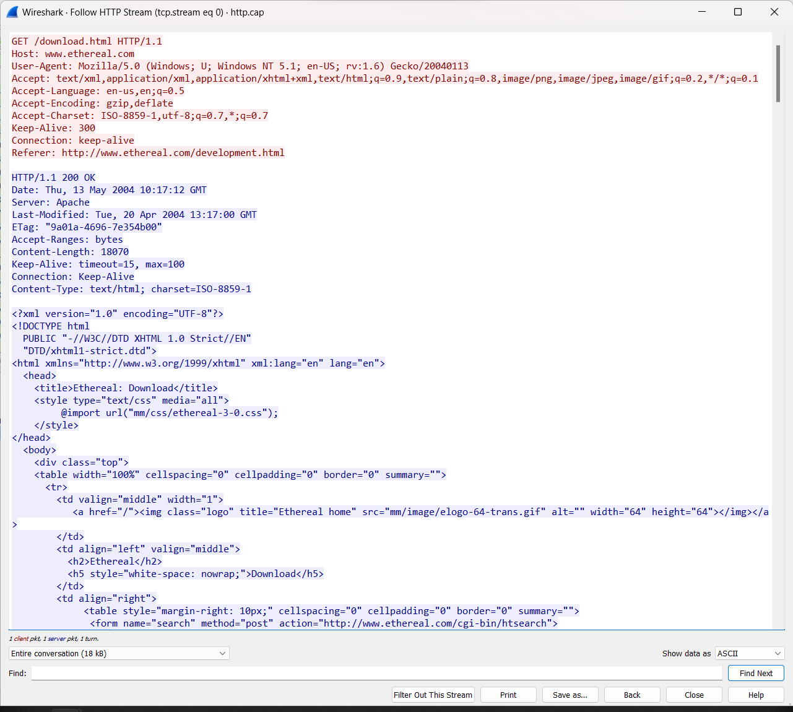
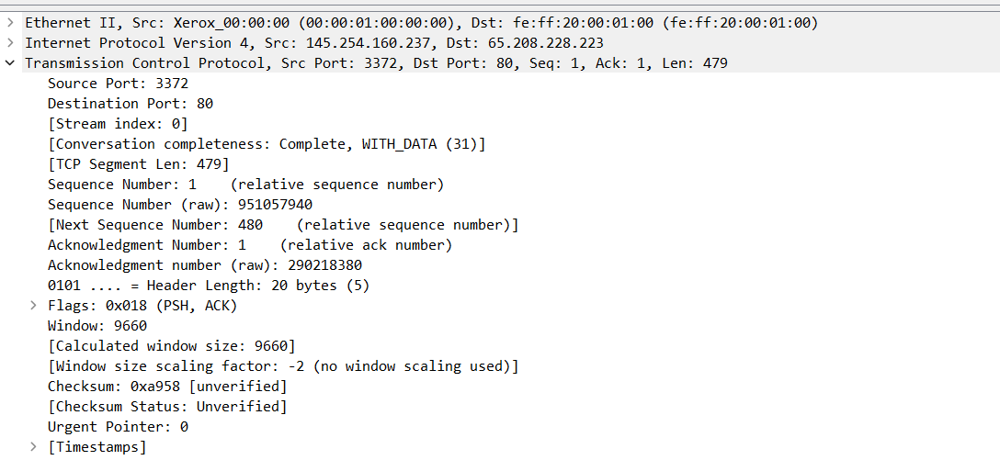
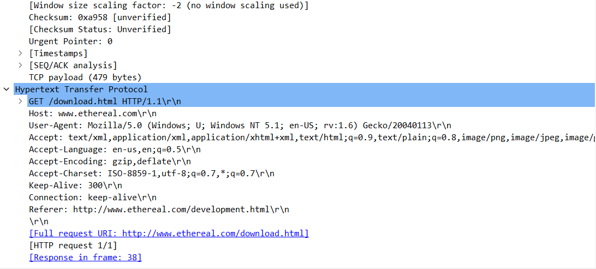

<h1>Praktikum Wireshark menggunakan Sample</h1>

 

Nama  : Mahargi Anugerahwan Pamungkas

Kelas : 2 D4 IT A

NRP   : 3122600012

 

Pada percobaan ini, kita menggunakan sample http.cap yang sudah kita download.

  

 

Untuk melihat seluruh aliran data dari sesi HTTP (HyperText Transfer Protocol) yang ditangkap dalam paket jaringan, kita dapat menggunakan fitur "Follow HTTP Stream". Ini membantu untuk melihat permintaan dan respons HTTP secara keseluruhan dalam konteks yang lebih mudah dibaca

  

 

Warna merah merupakan "request". ni mencakup permintaan yang dikirim oleh klien (seperti browser) ke server. Anda akan melihat detail seperti metode (GET, POST, dll.), URI, dan header permintaan.

  

 

Sedangkan warna biru merupakan "response". Ini mencakup balasan yang dikirim oleh server kepada klien sebagai tanggapan terhadap permintaan. Anda dapat melihat kode status HTTP, header respons, dan body data (jika ada).

  

 

Berikut jika keduanya digabungkan

  

 

Lalu kita juga dapat melihat berbagai informasi dari source yang kita inginkan. Semisalnya kita dapat melihat Source Port, dan Destination Portnya (Ditunjukkan bahwa Destination Portnya adalah 80 yang menandakan standar port untuk Web Server.)

  
  

 

